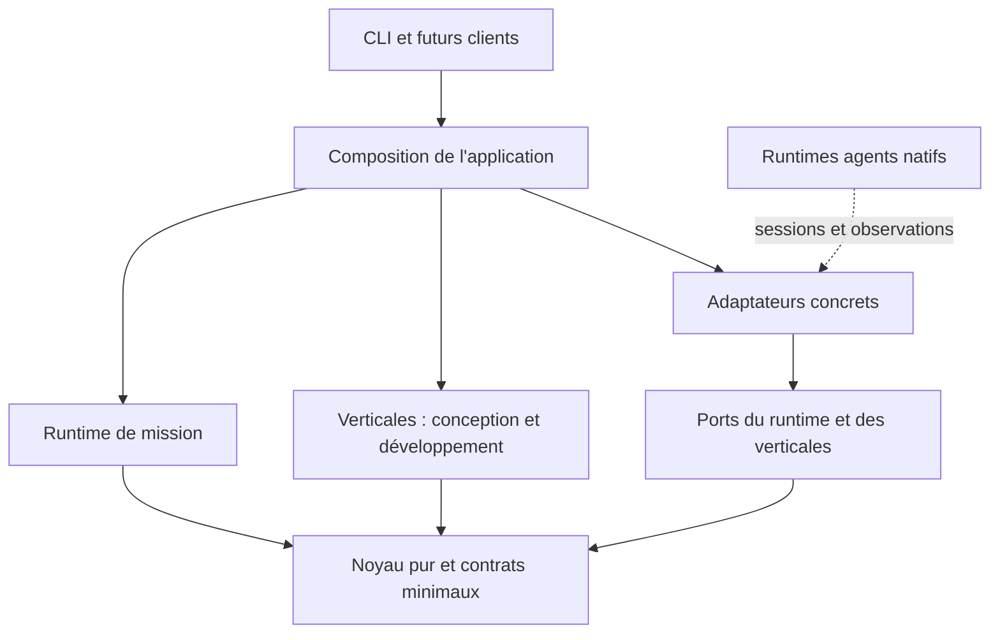

# Void Machine : porter, éprouver et stabiliser le socle TypeScript

## État au 21 septembre : socle M1/M2 fusionné, fondation en cours

La PR #393 a été fusionnée dans `develop` à `e0e8afa2`. Les receipts M1/M2 et les
mentions de PR ouverte plus bas sont des observations historiques à leur date.
Cette branche poursuit le socle privé sans basculer la distribution ni retirer Rust.

**Tranche de fiabilité actuelle, volet outillage.** `packages/void-machine` porte
seul le plancher Node >=24.15.0, TypeScript 7.0.2, Vitest 5.0.1, Zod 4.6.5 et
types Node 24. Sa configuration TypeScript est autonome et garde les options
strictes du pack consommateur, qui n'a pas été modifié. Build, typecheck et
111 tests du paquet sont verts sous Node 24.15.0 et 26.8.2 ; lint racine vert.
Le choix du plancher et son incidence sur `node:sqlite` sont dans
[l'ADR Node 24](../decisions-log/2026-09-21-machine-node-24-lts-floor--89f1ec74-3cf3-492a-be98-2ec03c924508.md).
**Volet séparation des couches.** Le test AST du graphe de modules couvre les
imports statiques, de types et les réexports, puis charge le runtime isolé.
RED observé avec un import de type `runtime -> verticals/development` (message
nommant l'arête), puis GREEN après son retrait. Les adaptateurs doctor qui
importent leur verticale implémentent ses ports et respectent le sens prévu.
Le [choix du parseur](../decisions-log/2026-09-21-machine-layer-import-ast-guard--ba06a613-526a-4101-8f6f-165e583d63b9.md)
est consigné. Remaniement sans comportement : les schémas `/1` et `/2` sont maintenant
possédés par la verticale note. L'admission et l'écriture ont été isolées dans
un module applicatif intermédiaire avant de rejoindre le driver générique. Les
113 tests sont restés verts à chaque commit de remaniement.
**Volet noyau générique.** Le réducteur pur des transitions se trouve dans
`core/mission.ts`, le driver durable et le fencing des révisions dans
`runtime/mission.ts`, les étapes, l'admission et les formats `/1` et `/2` dans la
verticale note ; l'application les compose. Les fixtures historiques se relisent
sans migration. Une verticale factice à trois étapes, format distinct et politique
différente prouve démarrage, reprise, effet inconnu, annulation, abandon, résultat
tardif ignoré et deux reprises concurrentes avec une seule exécution. Les preuves
RED et GREEN sont dans les tests de contrat. Le stockage fichier reste en place,
et aucun contrat de mission n'est exporté publiquement. Le choix est consigné dans
[l'ADR noyau](../decisions-log/2026-09-21-machine-generic-mission-core--b9347b31-9053-45e0-a153-0a7104c0191b.md).
Après le dernier changement de code, les 124 tests du paquet, son build et son
typecheck passent sous Node 24.15.0 et Node 26.8.2. `pnpm test:fast` racine passe
(2 599 tests) et le typecheck racine passe après compilation des déclarations déjà
requises de `pack-monorepo`. Le lint Biome racine est vert.
La lecture réadmet chaque résultat intermédiaire enregistré avant de reprendre,
d'annuler ou de livrer une mission terminée ; une valeur modifiée sans casser son
schéma est refusée. Les exceptions des codecs et des règles de la verticale donnent
un refus typé sans lancer une étape.

**Corrections de la relecture du noyau (21 septembre).** Chaque point a son commit,
son RED observé puis GREEN :

- Frontières : modules intégrés de Node refusés dans core, runtime et verticals via
  `isBuiltin`, paquets externes en liste blanche par couche, import dynamique calculé
  refusé partout ; huit sources refusées en dur doivent rester signalées. RED : cinq
  des huit passaient (`fs` sans préfixe, `node:os`, `createRequire`, paquet hors liste,
  `import(name)`).
- Vocabulaire : `step` dans tous les événements et reçus du noyau ; seuls le codec
  note (records `stage`) et le reçu public de la note traduisent. RED : typecheck
  TS2322 et cinq tests de la verticale factice exprimée en `step`.
- Source unique : `BlockedReason` défini dans le runtime et réexporté par l'application,
  borne `MISSION_EVENT_LIMIT` (32) exportée par core et lue par le runtime. RED : le
  test de borne importait une constante absente.
- Résultat live refusé : événement terminal `rejected { step, usage }` dans le noyau,
  reçu `rejected` à la reprise, coût observé conservé. La note l'écrit seulement en
  `note-mission/3` ; `/1` et `/2` se relisent à l'identique. RED : reçu `blocked` au
  lieu de `rejected` et codec note incapable d'encoder le refus.
- Admission en parseur : `admit` rend `{ ok, value }` ou `{ ok: false, reason }`, le
  codec décode des valeurs non admises et encode des valeurs admises, le runtime passe
  des valeurs typées aux étapes et reçus. La triple validation de la note et son `throw`
  disparaissent ; un refus local devient `rejected`, pas `outcome-unknown`. RED :
  typecheck TS2322 et quatre tests (valeur normalisée, refus local, refus live, relecture).
- Résultat tardif après annulation en vol : le perdant de la révision écrit `discarded
  { step, usage }` (note `/3`) ; coût conservé, valeur jamais enregistrée, aucune étape
  suivante, l'effet reste inconnu jusqu'à l'abandon. RED : usage tardif absent du reçu
  et du journal (test générique et deux tests CLI).
- Délais des tests de processus : bornes de blocage uniformes et généreuses, jamais une
  mesure de performance (enfant 20 s, test 30 s, au-dessus de ses enfants). Les attentes
  qui ordonnent deux processus attendent un événement, la ligne qu'un fixture envoie sur
  une socket locale en entrant dans sa barrière, au lieu de sonder un fichier sous un
  délai d'assertion. RED : 3 exécutions rouges sur 5 avec `--maxWorkers=2`, le budget du
  projet CI `contract:subprocess` (délais de 1,25 s du test doctor). GREEN : 20 exécutions
  vertes consécutives avec `--maxWorkers=2`.
- Garde de couches : le scan refuse tout fichier de `src/` hors des cinq couches ou qui
  n'est pas un `.ts` de production, un import local doit nommer un `.js`, et le test
  asserte avoir lu les modules connus de chaque couche. RED : 5 des nouveaux cas
  passaient (`.mjs` importé, `io.ts` à la racine comme importeur et comme fichier,
  `.d.ts`, couche inconnue).
- Globales hôtes : `tsconfig.pure.json` (`lib: ["ES2022"]`, `types: []`) branché sur
  `typecheck`, liste blanche `types/pure-globals.d.ts` (`AbortController`,
  `AbortSignal`, `TextEncoder`), fixture négative qui doit échouer. RED : le test
  échouait avec `types: ["node"]` (`process` accepté) ; sans liste blanche, le code
  réel échouait sur `AbortSignal`, `AbortController` et `TextEncoder`.
- API TypeScript 6 du garde AST : condition de retrait ajoutée à
  [l'ADR du garde](../decisions-log/2026-09-21-machine-layer-import-ast-guard--ba06a613-526a-4101-8f6f-165e583d63b9.md),
  encore `proposed` (l'ADR TS 7 ne donnait que la conséquence « jusqu'à une API 7.x »).
- Limite de généricité documentée (README et
  [ADR noyau](../decisions-log/2026-09-21-machine-generic-mission-core--b9347b31-9053-45e0-a153-0a7104c0191b.md),
  encore `proposed`) : pipeline linéaire d'au plus huit étapes fixes, 32 événements ;
  boucles revue/correction et attente de clarification (B2) feront évoluer le réducteur.

Preuves après la dernière correction : build, typecheck et 137 tests du paquet verts
sous Node 24.15.0 et 26.9.0 ; à la racine, lint, typecheck, `test:fast` (2 600 tests),
`decisions:check` (immuabilité vérifiée depuis `origin/develop`) et `derive:check`
verts. Les fixtures `/1` et `/2` se relisent octet pour octet.

**Restant vers le remplacement Rust.** Le mandat feuille blanche ci-dessous reste
directeur : A2–A5 sont suspendus, sans portage automatique de l'existant. Les besoins
et preuves déjà décrits dans ce plan restent à sélectionner et à éprouver :

- Reprise et annulation durables au-delà de la note M2 : annulation explicite, question
  en attente, abandon opérateur d'une étape inconnue et restauration de sauvegarde
  ([cycle de vie, §8](#8-runtime-général-persistance-et-cycle-de-vie) et
  [cas B3](#b3--reprendre-et-annuler-sans-perdre-ni-rejouer-le-travail)).
- Verticales et consommateurs à retenir sur besoins réels, puis substitution
  d'adaptateurs sans modifier le noyau ([réserve B2–B5, §11](#11-séquence-b--éprouver-le-moteur-général-avant-de-le-stabiliser)).
- Exécution Docker de Machine et articulation avec Cortex à prouver : aucune
  topologie n'est choisie et aucune garantie hébergée n'est acquise
  ([frontières, §5](#5-architecture-cible-proposée) et [limites, §17](#17-ce-qui-reste-volontairement-après-le-gel)).
- Stabilisation des contrats sur ces preuves, sans figer les signatures M1/M2
  prématurément ([jalon C, §12](#12-jalon-c--stabiliser-le-noyau-sur-des-preuves)).
- Bascule de l'entrée et de la distribution vers TypeScript, puis retrait de Rust
  après traitement explicite de la compatibilité des consommateurs retenus
  ([compatibilité, §7](#7-migration-des-capacités-rust-et-compatibilité) et
  [migration et retour arrière, §16](#16-vérification-revue-migration-et-retour-arrière)).

**Reprise durable de la note M2, 21 septembre : implémentée, vérifiée et éprouvée en réel, non fusionnée.**
`note start` et `note resume` persistent la mission dans un journal de fichiers en
ajout seul, sous une racine explicite (`--store`) : requête, modèles, délai, empreinte du
contrat, intention de chaque étape, extraction acceptée et note. Un nouveau processus
reprend la synthèse sans réexécuter l'extraction ; une mission terminée rend le même
livrable sans modèle. Une étape lancée sans issue enregistrée reste `outcome-unknown`,
sans relance. Deux reprises concurrentes ne lancent qu'une étape. Données corrompues,
format inconnu ou contrat changé : octets préservés, diagnostic, aucun appel. Un échec
observé reste terminal, sans retry dans cette tranche. `node:sqlite` est absent au plancher
Node 22.12.0 observé ; le choix et ses limites sont dans la
[décision journal fichier](../decisions-log/2026-09-21-machine-note-mission-file-journal--5450858b-e832-40f2-a066-1f176dda6f5f.md)
et le [README du paquet](../../packages/void-machine/README.md#durable-note-mission).
Garantie testée : crash du processus OS ; coupure machine en best-effort non prouvé.
GREEN 3 (96 tests), plancher Node 22.12.0 (52 tests), revue indépendante sans blocker et
parcours réel supervisé sous Node 22.12.0 (pause, reprise dans un nouveau processus, puis
reprise terminée sans modèle) sont consignés au [§22](#22-reprise-durable-de-la-note-21-septembre-2026). Cette tranche ne
crée aucun programme, scheduler ni moteur concurrent.
Curseur : l'annulation de la note est livrée sur cette branche. `note cancel` confirme
l'arrêt du flux Machine quand aucune étape n'est en vol, et rend `requested-unconfirmed`
avec effet et usage inconnus sinon. `note abandon` clôt explicitement une étape inconnue
sans jamais la relancer. Un résultat tardif après annulation n'est pas journalisé et ne
déclenche aucune synthèse. Les records d'annulation sont en `note-mission/2` ; les autres
restent en `/1`. Aucun arrêt natif, handler de signal ni réconciliation automatique. Les
limites sont détaillées au [README du paquet](../../packages/void-machine/README.md#durable-note-mission).
Preuve du 21 septembre 2026 pour cette tranche, observée par ORCH via RUN : RED initial de
13 nouveaux tests CLI en échec (commandes absentes), 25 anciens verts ; RED ciblé de 1 test
sur la course où cancel perd sa révision (cancel en 3 face au gagnant `completed` en 0),
puis correction par une relecture unique. GREEN : 111/111 tests sur 6 suites, build,
typecheck des tests et lint à zéro, hors les deux infos antérieures de `repository.ts`.
Revue indépendante finale sans blocker démontré ; ses suggestions restent advisory. Le
parcours réel supervisé du §22 date de la reprise M2 sous Node 22.12.0 et ne couvre pas
l'annulation : aucun parcours live externe n'a été exécuté pour cette tranche.

## Delta directeur du 20 septembre : besoin avant héritage

**Cette section prévaut sur la séquence A0–A5 et sur toute dépendance « A complet
avant B » décrite plus bas.** Folpe autorise une feuille blanche, en capitalisant
sur les apprentissages du harnais : conserver ce qui répond à un besoin, corriger
ou supprimer les erreurs, ne pas reproduire les contrôles parce qu'ils existent.
Le Rust est une source historique et un instrument de caractérisation, pas une
spécification produit autoritaire. La compatibilité répond aux consommateurs
identifiés ; elle n'est pas un préalable universel à une mission nouvelle.

A0 et A1 ont été réalisés et leurs commits/preuves sont conservés. La progression
automatique A2–A5 est suspendue ; leurs listes sont désormais des propositions
historiques à réadmettre par besoin. Les sections B/C restent une réserve de cas
et de décisions futures, pas une permission de construire toute la plateforme.
La revue ciblée M1 est close sans BLOCKER. M1 est implémenté et ses 22 contrats
passent via RUN ; intégration GREEN à 4396703b (sept commandes, 22 contrats).
La revue indépendante finale M2 est désormais close sans BLOCKER ; le
[receipt §21](#21-m2-runtime-receipt-20-septembre-2026) porte les preuves runtime.
Le registre lié ci-dessous conserve le receipt et la checklist M1 historiques.
Doctrine, programme Linear, ADR acceptées et installation active restent inchangés.

### Disposition des suites après M1 GREEN

Les trois contrats publics A0 visaient exclusivement une bascule CLI A5, désormais
non livrée. Ils sortent de la suite active, sans skip ; leur contenu est conservé
par Git (bebbb0e4) et en archive locale avec SHA-256. Les brouillons A2 non exécutés,
le sujet M1 absent remplacé par la production et Cargo.lock généré par la baseline
sont conservés hors sources sous `.void/machine/typescript-port/archive/` avec
motif individuel. Aucun verrou n'est édité manuellement. Les contrats doctor A1,
les 22 contrats M1 et les régressions existantes du lanceur natif restent actifs.
Le registre détaille la disposition ; aucune suppression Rust ni bascule n'est
requise pour faire passer cette tranche. Une future migration réadmettra ses
contrats à partir de consommateurs identifiés.

### Impact concret sur les capacités héritées

Le [registre révisé](2026-09-20-void-machine-typescript-parity.md#disposition-du-mandat-feuille-blanche)
porte besoin, preuve de consommateur, propriétaire et disposition par capacité.
Les exports Rust effets/cluster/merge et leurs ledgers ne montrent aucun appel de
production dans le périmètre inspecté : leur présence et leurs tests ne gagnent
pas leur place dans Machine. Ils sont différés, sans suppression actuelle du Rust.

Les commandes doctor/skill check sont des surfaces documentées du CLI, à traiter
explicitement lors d'une bascule de distribution. Cela ne leur donne pas autorité
sur toutes les missions. Les lecteurs legacy réellement utilisés, notamment
`autopilot.ts -> durable-run.ts`, restent chez leur propriétaire existant.
Le package privé et la direction des couches restent appropriés ; rien ne justifie
un nouveau service, un port coordinateur, un framework de plugins ou une publication.

### A1 : ce qui a été repris trop vite

Doctor est une capacité de diagnostic développement optionnelle, pas une preuve
que Machine fonctionne. Son passage healthy dans un dépôt ne contenant aucune
configuration Machine ne certifie ni installation, ni agent, ni travail livré.
A1 a été choisi pour sa présence dans le plan de portage, sans usage consommateur
observé qui le rende préalable au socle de mission. Son maintien comme adaptateur
isolé est acceptable ; sa généralisation en gate obligatoire ne l'est pas.

Le diagnostic de fichiers machine.toml/machine.lock.json n'a pas de producteur ou
lecteur métier identifié au-delà du doctor. Valider des champs state_dir/cache_dir
puis les ignorer reproduit une incohérence ; cette sémantique ne doit pas devenir
le format du nouveau runtime. Le parsing correct reste utile si cette surface est
retenue. Son existence ne justifie ni le format ni son coût de paquet à elle seule.
Les tests v1 protègent seulement cette commande existante, pas une vérité du core.

### Tranche M1 réalisée : relais local et deux spécialistes

Cadrage historique conservé ci-dessous ; M1 est terminé. Les propositions de
transport sont disposées dans la signature finale M1 plus bas. La route réelle
ultérieure est maintenant prouvée par [M2 (§21)](#21-m2-runtime-receipt-20-septembre-2026).

**Objectif observable :** une demande non-Git produit une note structurée à partir
de deux documents locaux fournis, par un rôle d'extraction puis un rôle de synthèse.
Le relais distribue les entrées et collecte les résultats ; il ne décide ni états
ni autorisations par sa conversation. Le résultat est jugé sur la note attendue,
jamais sur le seul exit 0 d'un processus.

Périmètre minimal proposé à l’époque, avant la production M1 :

- Un parcours fixe, une mission, deux unités séquentielles et un validateur de
  livrable propre à ce parcours. Pas de graphe configurable ni de scheduler.
- Deux configurations d'agent distinctes à la composition/adaptateur, pouvant
  désigner des modèles différents. Le mécanisme générique ne connaît aucun
  fournisseur, modèle, Git, SKILL.md, panneau ou règle de revue.
- Contexte et chemins explicitement fournis ; aucun HOME, terminal ou Mac requis.
  Un résultat manquant expose cause, responsable et action utile ; un résultat
  invalide n'est pas livré et ne déclenche pas une boucle de revue implicite.
- Preuve locale par fonctions injectées et petits processus de fixture déterministes,
  sans API payante ni invocation de modèles réels. Vérifier deux routages distincts,
  collecte correcte, livraison valide, résultat absent/invalide et exit 0 trompeur.
  Cette preuve ne certifie ni modèles réels, ni isolation de conteneur, ni reprise
  après crash. Ne pas inventer une durabilité pour cette première tranche.

Une seule composition statique, avec le moins de mécanismes génériques nécessaire
à ces cas. Pas d'API publique stabilisée avant preuve. Le stockage durable, la
reprise/annulation complète, la route réelle de modèle et le parcours à clarification
restent des tranches ultérieures nommées, pas des obligations absorbées par M1.
Aucun Dockerfile, déploiement ou choix de topologie conteneur dans M1.

### M1 : entrées, livrable et frontière vers un runtime réel

Précision de contrat proposée pendant la revue ciblée, pas une API stabilisée.
M1 est une tranche du socle. Elle ne clôt pas la demande d'agents réellement
exécutés avec des modèles distincts et n'en remplace pas la preuve par une simulation.

**Entrée métier.** Un identifiant de demande opaque, une question explicite et
exactement deux sources `{ sourceId, title, text }`, identifiants distincts,
texte UTF-8 fourni par l'appelant. Les chemins de lecture ne sont pas le texte
métier et restent chez l'adaptateur d'entrée. Aucun chemin implicite ni lecture
arbitraire suggérée par un agent. Pour cette tranche, proposition de limites :
question de 1 à 4 000 caractères, 1 à 65 536 octets par source, réponse d'agent
limitée à 65 536 octets. Ce sont des bornes locales à éprouver, pas des règles
du futur moteur ou une affirmation de capacité de chaque modèle.

**Extraction.** Le premier rôle reçoit la question et les deux sources. Il rend
une liste de 1 à 16 extraits `{ sourceId, quote }` et une liste bornée de lacunes
pertinentes. Chaque citation doit exister exactement dans la source nommée ; une
source absente, un identifiant inventé ou un extrait vide refuse ce résultat.
Aucune normalisation Unicode ou reconstruction de citation ne corrige sa sortie.

**Synthèse.** Le second rôle ne démarre qu'après admission du résultat d'extraction.
Il reçoit question, sources et extraits admis. Il rend une note JSON comprenant
`title`, `summary`, `evidence` (extraits avec sourceId) et `limitations`. La note
doit contenir au moins une référence valide à chaque source et aucune référence
externe inventée. L'appelant reçoit cette note structurée ; export Markdown ou
stockage de mission ne sont pas requis pour M1. Les fixtures définissent un cas
concret de comparaison de deux propositions fournies, sans accès réseau.

**Sens du verdict.** Le validateur de ce parcours vérifie structure, bornes,
traçabilité des citations, couverture des deux sources et rattachement au travail
attendu. Il ne sait pas prouver qu'une paraphrase est juste, qu'un résumé est
exhaustif ou qu'il satisfait l'utilisateur. Le résultat est « note structurée et
sourcée acceptée par ce contrat », jamais « qualité intellectuelle certifiée ».
Les fixtures peuvent vérifier une note attendue exactement ; la qualité d'une
note de modèle réel nécessitera sa propre observation, nommée dans la suite.

**Contrat d'exécution minimal.** La composition reçoit deux fonctions d'exécution
asynchrones, une par rôle, au lieu d'un registre/plugins ou d'un coordinateur-port.
Chacune reçoit une demande portant `executionId`, consigne et matériaux bornés,
ainsi qu'une échéance/durée maximale explicite et un signal d'annulation. Elle
rend une observation corrélée à ce même executionId :

- `result` avec charge utile non fiable, à parser/valider par le parcours ;
- `unavailable` avec cause et action possible (runtime/auth/capacité indisponible) ;
- `interrupted` ou `failed` avec cause, sans résultat accepté implicite.

Le type exact sera dicté par les premiers tests. Une exception de transport est
convertie à cette frontière, jamais avalée ni transformée en succès. Un exit 0
sans charge utile valide est un échec de résultat. Aucune répétition automatique.
Un résultat manquant expose cause, responsable et action utile ; la reprise durable
ou une boucle de clarification ne sont pas promises par ce retour M1.

**Vrai runtime versus fixture.** Un adaptateur natif pourra utiliser ces mêmes
fonctions pour lancer une session et collecter son résultat asynchrone ; il ne
sera pas obligé de prétendre être un processus retournant du JSON sur stdout.
Configuration runtime/modèle, authentification, cwd/workspace, traduction du
protocole natif, timeout et arrêt des ressources restent à cette frontière.
Le parcours et les mécanismes génériques ne contiennent ni fournisseur ni modèle.
L'annulation demandée n'est pas assimilée à une annulation effective si le runtime
ne peut pas l'attester ; aucune garantie d'isolation n'est inventée.

Deux routes distinctes ont été injectées dans M1. Leur preuve locale dit « fixture »
et distingue destination configurée de runtime/modèle effectivement observé.
Une simple chaîne portant un nom de modèle n'est pas une exécution de ce modèle.
Les agents simulés et processus de fixture doivent passer par le même contrat
d'admission que le futur adaptateur réel ; aucun shortcut donnant directement
une note validée au runtime n'est une preuve du parcours.

**Suite de M1, désormais éprouvée par M2.** La route Claude, les deux sessions,
les modèles demandés et observés, le livrable et les mesures sont consignés dans le
[receipt §21](#21-m2-runtime-receipt-20-septembre-2026), avec leurs limites.
Interruption/reprise durable, Docker/hébergement, permissions distantes et API
publique stabilisée restent à éprouver selon les besoins retenus.

### Disposition finale de revue M1 et signature avant RED

Revue de c554e60c terminée, aucun BLOCKER, aucune nouvelle boucle de préparation.
La demande antérieure de fixture sous-processus est explicitement retirée : M1
prouve le routage par deux fonctions asynchrones injectées et l'admission de leur
observation. Les exemples exit 0/stdout ne créent aucun contrat de transport ni
adaptateur obligatoire. Aucun type ou diagnostic n'est importé depuis doctor.

Signature de travail minimale, privée et non stabilisée :

- `runNote(input, { extract, synthesize, executionIds, timeoutMs, clock })` rend
  une promesse de note admise ou d'arrêt nommé au stade input/extraction/synthesis.
- Chaque exécuteur reçoit `{ executionId, instruction, input, timeoutMs, signal }`
  et rend une promesse d'observation non fiable. Son enveloppe result/unavailable/
  interrupted/failed est validée avant emploi, puis le payload par le parcours.
  Ni code de sortie, ni JSON stdout, ni fournisseur/modèle dans ce contrat.
- La composition fournit deux executionIds non vides et distincts, nouveaux pour
  ces invocations ; un résultat ancien, absent ou croisé ne peut être accepté.
  Aucun ledger global n'est créé. La corrélation a des tests hostiles aux deux stades.
- L'horloge injectée a une seule opération `schedule(delayMs, onElapsed) -> cancel`.
  Le runtime appelant arme cette borne **avant** d'appeler l'exécuteur et cesse
  d'attendre lorsqu'elle expire, même si la promesse ne se résout jamais. Il émet
  AbortSignal, rend `cancellation: requested-unconfirmed`, ne prétend pas arrêter
  le runtime distant et ne réessaie pas. Une fin normale désarme la borne.
- Aucun besoin de Date.now, horloge murale, ordonnanceur, persistance ou polling.
  Une horloge manuelle de test contrôle les échéances sans sleeps. La composition
  réelle pourra fournir le simple timer de son hôte, sans changer le parcours.

RED couvre routage A sources / B extraction admise, result avec payload invalide,
identifiant erroné/ancien, fonction jamais résolue, annulation demandée mais non
certifiée et absence de second dispatch après refus. Les citations exactes restent
une règle de **ce parcours**, à réexaminer sur observation d'un modèle réel dans
une tranche ultérieure. Elles n'entrent ni dans le mécanisme d'attente ni dans le core.

**Ordre historique M1, exécuté :** disposition du delta avec ORCH, précision de
l'entrée et du livrable, contrats RED puis implémentation.
Les travaux de compatibilité/distribution sont repris séparément lorsqu'une surface
consommée change ; le retrait de Rust n'est ni oublié ni une condition d'entrée M1.
La clôture du produit attendra les preuves des capacités effectivement retenues et
la migration de leurs consommateurs, sans obligation de réimplémenter tout Rust.

## 1. Résultat recherché et portée de ce document

Construire un socle maintenable qui accélère le travail des consommateurs, avec un
noyau déterministe petit et stable, des politiques propres aux domaines et des
adaptateurs remplaçables. La réussite ne se mesure ni au nombre de contrôles ni au
nombre d'agents : elle se mesure au travail livré, à sa correction et aux interventions
évitées. Une modification ordinaire dans un projet consommateur ne doit pas exiger
une modification du moteur et une redistribution du harnais.

Demande explicite de Folpe, le 20 septembre : prendre en compte les documents
existants, ne pas reproduire les blocages du harnais, séparer fortement les couches,
concevoir sans rustine puis stabiliser le noyau avant de développer dessus.
Ce texte rend cette exigence vérifiable. Il ne modifie pas la doctrine installée.

Ce plan consolide l'ordre de réalisation, les propriétaires et les preuves. Il
s'appuie sur les specs approuvées ; les nouveaux choix d'organisation proposés ici
sont à relire avant exécution. Il ne transforme pas une proposition en ADR acceptée.
Une décision structurante effectivement retenue sera enregistrée par le mécanisme
existant `void-harness decisions new`, sans modifier les ADR historiques.

Trois jalons distincts :

| Jalon | Résultat observable | Ce qu'il ne prétend pas prouver |
| --- | --- | --- |
| A. Parité TypeScript | Les capacités Rust retenues fonctionnent via le paquet et les bonnes couches ; Rust remplacé dans le candidat | Un moteur général de missions déjà complet |
| B. Socle général éprouvé | Une mission sans Git survit à clarification, interruption, correction et livraison ; une mission de développement utilise le même noyau | L'hébergement multi-client ou tous les runtimes |
| C. Contrat stabilisé | Les scénarios consommateurs et d'extension passent sans modifier le noyau ; API, données, limites et retour arrière documentés | Un code intangible ou exempt de tout défaut futur |

Cette décomposition A/B/C est historique : le delta directeur a suspendu A2–A5
et levé la dépendance « A complet avant B ». A0/A1 puis M1/M2 ont été réalisés ;
les propositions restantes sont à réadmettre par besoin, sans reprise automatique
de leur ordre. Installation active, publication de release, dépenses supplémentaires
et promotion production gardent leurs autorisations distinctes.

### Précision du mandat de réalisation A0-A5

Le démarrage approuvé retient le package unique proposé, à consigner par ADR.
ORCH assure distribution, relais des questions et collecte ; WORK-1 reste auteur
unique du code et des corrections, avec avis architecture puis revue indépendante
fournis par ORCH. Aucun second contrôleur n'est créé pour réaliser ce port.
Les agents spécialisés pourront employer différents modèles via leurs adaptateurs.
La cible future Machine/Cortex peut être conteneurisée : les chemins et ressources
sont explicites, sans dépendance obligatoire au Mac, terminal ou HOME implicite.
A n'ajoute aucun Dockerfile, déploiement, choix de topologie Docker ni connecteur.
La [matrice A0](2026-09-20-void-machine-typescript-parity.md) porte l'inventaire et
les preuves du port ; elle ne remplace pas l'état du programme Linear existant.

## 2. Sources, précédence et traitement des divergences

### 2.1 Sources directrices

La demande actuelle précise l'objectif de simplicité et de stabilité. Pour le
périmètre immédiat, la consigne originale et la spec du portage priment sur les
anciens détails Rust. Les visions orientent la suite ; elles n'imposent pas de tout
construire dans A. Le code établit l'existant, pas ce qui serait souhaitable.

| Réf. | Source | Usage dans ce plan |
| --- | --- | --- |
| R01 | [Instruction originale](../../instruction-portage-void-machine-typescript.txt) | Autorisation, ordre, parité, couches, refus de l'héritage automatique, coût, revue et fin |
| R02 | [Spec du portage borné](../specs/2026-09-19-void-machine-typescript-port.md) | Contrat d'acceptation de A ; ne pas élargir vers le moteur complet |
| R03 | [Vision Machine](../VOID-MACHINE-VISION.md) | Capacités natives, état minimal, indépendance des verticales et résultats utiles |
| R04 | [Vision Machine / Cortex / Déclic](../DECLIC-MACHINE-VISION-2026-09-13.md) | Utilisation sans Cortex, spécialités, politiques client ; hébergement et connecteurs ultérieurs |
| R05 | [Spec du parcours supervisé](../specs/2026-09-19-supervised-design-orchestration.md) | Mandat, confidentialité, parcours non-Git, reprise, bornes et limites réelles |
| R06 | [Plan du parcours supervisé](2026-09-19-supervised-design-orchestration-plan.md) | Séquence antérieure S0–S4 ; correspondance avec B dans la section 13 |
| R07 | [ADR TypeScript et propriétaires](../decisions-log/2026-09-19-void-machine-typescript-layer-ownership--e492e50e-86b0-4427-9fdf-2435750ce60d.md) | Direction TypeScript, remplacement explicite de la continuation Rust |
| R08 | [ADR précédente : noyau neuf](../decisions-log/2026-09-19-void-machine-new-core-demonstrated-needs--873d1c5a-ef12-44c7-84dd-2fcd853b7ab8.md) | Provenance du refus d'hériter des contrôles ; choix Rust supersédé par R07 |

R07 et R08 portent encore `status: proposed` dans les fichiers, tout en consignant
les décisions humaines. Leur fusion dans Git ne change pas automatiquement leur
statut documentaire. Ne pas en déduire une permission supplémentaire. Régulariser
leur statut par le workflow ADR lorsque nécessaire, sans réécrire leur histoire.

### 2.2 Sources de compatibilité et leçons du harnais

| Réf. | Source | Contrainte ou enseignement retenu |
| --- | --- | --- |
| R09 | [Spec du pivot natif](../specs/2026-09-10-native-void-machine-pivot.md) et [plan](2026-09-10-native-void-machine-pivot-plan.md) | Oracle, doctor, skill check, durable no-effect run ; historique Rust à adapter |
| R10 | [Architecture actuelle](../ARCHITECTURE.md) | Propriétaires actuels, installation/source self-host, événements, compatibilité ; description du harnais, pas modèle à recopier |
| R11 | [Compatibilité des versions consommateurs](../specs/2026-09-10-consumer-version-compatibility.md) | Une analyse optionnelle incompatible ne dégrade pas toute la mission |
| R12 | [Revues bornées](../BOUNDED-REVIEWS.md) | Une revue consolidée, corrections ciblées, provenance réelle, aucune promotion rétrospective |
| R13 | [Supervision native](../NATIVE-SUPERVISION.md) et [spec d'affichage](../specs/2026-09-05-visible-agent-supervision.md) | Affichage optionnel, identité observée, pas d'agent doublé pour un panneau |
| R14 | [Worktrees](../WORKTREES.md) et [philosophie](../PHILOSOPHY.md) | Isolation durable, conservation du travail, séparation cycle de vie/panneaux |
| R15 | [Reprise du programme](../specs/2026-08-26-program-resume-contract.md) et [continuité mécanique](../specs/2026-08-27-mechanical-context-continuity.md) | Un propriétaire par information ; ne pas importer leur machinerie dans le nouveau noyau |
| R16 | [Mesure de valeur](../specs/2026-09-07-mesurer-valeur-implement-autopilot.md) | Comparer à l'exécution native, qualité d'abord, inconnues explicites ; pas de campagne payante implicite |
| R17 | [Audit du coût des tests](../audits/2026-09-16-test-cost-optimization.md) et [spec](../specs/2026-09-16-test-cost-optimization.md) | Une campagne lourde à la fois, mesures comparables, pas de retry pour verdir |
| R18 | [Certification Codex](../reports/2026-09-11-codex-subscription-certification.md) et [Claude](../reports/2026-09-11-claude-subscription-certification.md) | Observations historiques limitées ; ne prouvent pas confinement, reprise et annulation du futur parcours |
| R19 | [Programme livré](2026-09-16-seven-ticket-delivery.md) et [spec](../specs/2026-09-16-seven-ticket-delivery.md) | Contexte précédent conservé ; pas de sélection automatique de tickets à partir de ce plan |

Le checkpoint et les preuves locales de septembre servent à retrouver les incidents,
pas à fournir des dépendances de build. [AGENTS.md](../../AGENTS.md), la philosophie
installée et la doctrine projet gouvernent le travail sur ce dépôt ; leurs règles
de développement ne deviennent pas des obligations de chaque mission Machine.
`docs/VISION.md`, les anciens plans de harnais, le registre des skills et les mentions
incidentales dans les audits restent de la provenance. Ils ne réintroduisent pas un
second moteur ou une plateforme de plugins dans ce périmètre.

### 2.3 Divergences résolues pour l'exécution proposée

| Divergence | Traitement explicite |
| --- | --- |
| Ancienne vision attribuant toute exécution/persistance au « kernel » | Lire « Machine » au niveau produit ; noyau pur et runtime ont les propriétaires distincts de R02 |
| R06 S3 nomme encore des fichiers Rust et S4 un binaire natif | Références historiques ; B utilise les successeurs TypeScript portés dans A. Aucun nouveau travail Rust après A |
| R05 impose parfois SQLite/outbox et donne des durées candidates | Préserver les garanties de reprise ; choix technique motivé en B0, nombres candidats non promus en règles universelles |
| Contrôleur du harnais déjà riche | Réutilisation ciblée de mécanismes justifiés, jamais import du contrôleur complet |
| Interprétation « chaque mission doit produire spec/plan/revue » | Seulement le workflow de conception ; collecte simple et autres verticales ont leur propre livraison |
| « Figer » avant toute exécution réelle | Stabiliser après A puis les preuves B ; corriger les frontières avant le gel C |
| Fondation DEV-807 mentionnée mais documents absents des inventaires antérieurs | A0 consigne l'absence et recherche seulement ce qui gouverne une migration concernée ; pas de reconstitution ni blocage global |

La correction éditoriale de R06 signalée lors de la PR #392 est traitée ici par cette
correspondance. Lors de la mise à jour documentaire de A5/B3, remplacer ses chemins
exécutables par les destinations réellement livrées ; ne pas modifier une ADR acceptée.

## 3. État réel de départ et limites de connaissance

Base de lecture : `85f177b1`, `develop` après PR #392. WORK-1/2/3 et les documents
ont été intégrés. Le diff depuis `1efeedf1` est vide sur `native/void-machine` et
`packages/cli/bin/void-machine.mjs` : l'inventaire Rust initial reste pertinent.
Les huit fichiers Rust incluent un fichier de tests ; les chiffres initiaux
1 542 lignes hors tests, 451 lignes de tests et 28 tests sont une estimation
d'inventaire, pas une mesure de couverture ni de maturité du produit.

Constats importants issus des sources :

- Le CLI Rust expose `doctor` et `skill check`, pas un CLI général de missions.
- Son « core » contient des types Git, tickets, revues et commandes `gh`. Le
  changement de langage doit déplacer ces responsabilités, pas seulement les traduire.
- Les ledgers cluster/merge sont en mémoire. Leur nom et leurs tests ne prouvent pas
  une déduplication durable après crash. Ne pas la revendiquer dans A.
- L'adaptateur Rust contient SHA-256, JSON et parsing YAML/TOML artisanaux. Le port
  emploiera des primitives et parseurs maintenus ; les approximations ne sont pas des contrats.
- Le lanceur npm délègue actuellement à `VOID_MACHINE_BIN` ou `void-machine`.
  Le paquet déclare déjà ce nom de commande. La disparition de la dépendance au
  binaire est une bascule explicite, avec traitement du réglage d'environnement.
- `durable-run.ts` est déjà TypeScript : quatre phases et `authoritativeEffects: 0`.
  Il est un candidat pour les transactions, pas le moteur de missions à généraliser.
- `packages/mission-engine` contient les règles du harnais existant. Son nom n'en
  fait pas le propriétaire automatique du nouveau noyau.
- Les adaptateurs privés d'évaluation et leurs certifications sont des sources de
  cas de conformité ; le paquet public ne doit pas importer `apps/eval-harness`.

La CI de PR #392 a passé sur le même arbre que cette base. Aucune exécution native,
mesure de performance du port ni certification du futur moteur n'est produite par
ce plan. Les capacités des interfaces externes seront vérifiées sur les versions
effectivement choisies avant leur configuration.

## 4. Les erreurs à ne pas reconduire

Le harnais reste utilisable selon ses propres règles pendant la transition. On ne
supprime pas ses protections pour le débloquer ; on évite d'en faire des dépendances
du nouveau produit. La séparation doit être prouvée sur les situations suivantes.

| Situation à prévenir | Réponse architecturale | Preuve d'acceptation |
| --- | --- | --- |
| Version de framework consommateur inconnue, mission bloquée globalement | Capacité requise/optionnelle par opération, outils du projet | Une analyse optionnelle indisponible laisse le travail autorisé avancer ; un typecheck requis absent bloque sa validation |
| Règle propre à un projet obligeant à patcher puis republier le noyau | Politique locale déclarative et versionnée, validateur de la verticale | Deux projets choisissent des politiques différentes avec les mêmes octets de noyau |
| Validation d'une preuve demandée avant que l'étape puisse la produire | Prérequis exprimés par l'étape propriétaire | La revue du résultat n'est pas demandée avant sa production |
| Plusieurs contrôleurs, prompts et journaux donnent des états différents | Un état transactionnel par mission, prompts descriptifs | Redémarrage depuis cet état seul ; aucun Markdown ne décide d'une transition |
| Complément de contexte compté comme nouvelle correction | Événement de contexte distinct de modification d'artefact | Même mission, résultats valides réutilisés, compteur de correction inchangé |
| Une remarque de style déclenche une nouvelle tournée de revues | Sévérité par conséquence dans la verticale | Advisory conservé ; zéro nouveau dispatch pour le « résoudre » |
| Identifiant natif indisponible bloque une revue pourtant traçable | Provenance minimale suffisante, limites explicites | Preuve réelle alternative admissible ; aucune identité inventée |
| Agent idle oublié ou relancé en double | Observation d'exécution distincte de résultat accepté | Question visible, résultat collecté, aucune relance sur le seul signal idle |
| Une panne d'affichage ou d'index rend le moteur indisponible | Adaptateur optionnel hors chemin d'autorisation | Même mission livrée sans affichage ni index facultatif |
| Succès d'un processus assimilé à réussite du travail | La verticale juge le livrable et le runtime collecte | Processus exit 0 avec artefact invalide n'est pas `delivered` |
| Mise à jour modifiant les missions en cours ou les règles utilisateur | Pin des versions par mission, migration explicite | Ancienne mission reprenable ; aucune nouvelle politique appliquée rétroactivement |
| Résultat externe ambigu suivi d'un retry aveugle | Identité d'action et réconciliation | Un seul effet observable malgré perte d'ack et redémarrage |
| Tests et revues saturant le poste | File de travaux lourds unique, contrôles ciblés | Pic mémoire/processus mesuré, un worker de tests, aucune suite inchangée relancée |
| Contrôle valide mais trop coûteux à maintenir | Justification courte du besoin et du propriétaire | Toute nouvelle mécanique répond à un cas de panne testable ; sinon différée |

Cette table est le registre d'acceptation, pas un nouveau moteur de gouvernance.
Les contrôles de code sont regroupés dans les tests existants, pas multipliés en
hooks qui interceptent chaque opération du consommateur.

## 5. Architecture cible proposée

### 5.1 Choix et alternatives

| Approche | Intérêt | Coût et risque | Position |
| --- | --- | --- | --- |
| Traduction Rust vers TypeScript dans le contrôleur actuel | Réutilisation immédiate | Conserve le couplage aux tickets, preuves et cycles du harnais | Écartée : ne répond pas au problème consommateur |
| Un module Machine cohérent, couches explicites, composition statique | Frontières testables, déploiement simple, parité progressive | Petit raccord au build/CLI, migration des propriétaires à expliciter | Recommandée |
| Plusieurs services et plateforme dynamique de plugins | Isolation de processus et extensions distribuées | Auth, réseau, versions et supervision avant la première valeur | Différée : aucun besoin démontré dans A/B |

Proposition concrète : **un seul nouveau package de travail privé**
`packages/void-machine`, distribué à travers le CLI existant. Il remplace l'espace
Rust, n'ajoute pas un second service et ne devient pas un package par couche.
Il rend impossible un import implicite du contrôleur du harnais. Ajouter son entrée
au workspace seulement avec A1 ; le moteur publié reste un artefact cohérent.
Ce choix reste une proposition de ce plan, à enregistrer par ADR s'il est retenu.

### 5.2 Propriétaires et dépendances



Les flèches pleines signifient « importe/dépend de ». L'application assemble les
implémentations ; un port est défini par celui qui en a besoin. Il n'y a pas de
package `ports`, de bus ni de service locator à créer pour réaliser ce diagramme.

| Couche | Possède | Ne possède pas |
| --- | --- | --- |
| Noyau pur | Identités, révisions, transitions génériques, autorité bornée, état d'un effet, acceptation d'observations liées à leur sujet | Git, PR, SKILL.md, TypeScript consommateur, revue de code, sockets, SQLite, horloge système, SDK LLM, panneau |
| Runtime de mission | Driver, transactions, exécution des décisions, réservations, suivi d'agents, attente/reprise/annulation, collecte durable | Raisonnement du modèle, politique Git, qualité éditoriale, formats d'un fournisseur |
| Verticale | Méthode du domaine, sous-étapes, critères de livraison, obligations de preuve et moment où elles sont dues | Persistance concurrente de la mission, invocation directe d'un runtime, modification des permissions |
| Adaptateur | Traduction d'un port, opérations Git/fichiers/processus/stockage, résultats observés, confinement natif | Politique implicite de livraison, élargissement du mandat, verdict de réussite global |
| Composition/CLI | Configuration explicite des modules, validation de l'entrée publique, sélection d'une route admissible et rendu | Second reducer, logique métier copiée, privilèges cachés |
| Coordinateur LLM | Comprendre l'objectif, proposer le travail, relayer la clarification, rapprocher les résultats | Accorder une permission, écrire l'état autoritaire, valider seul sa propre indépendance |
| Client/présentation | Afficher, transmettre les demandes autorisées, montrer états et résultats | Décider qu'une tâche est finie ou supprimer worktrees/preuves |

Les politiques de développement dépendent du noyau. Le noyau ne choisit pas « la
bonne politique » en fonction d'un framework. La dépendance à une interface métier
concrète ne se cache pas dans un type générique avec des champs `pr` ou `reviewRound`.

### 5.3 Organisation proposée, créée au fil des tranches

```text
packages/void-machine/
  src/core/                    identités, révisions, effets, puis mission générique
  src/runtime/                 driver et ports de stockage/exécution, ajoutés en B
  src/verticals/development/   doctor historique, skills, Git, cluster et merge
  src/verticals/design/        workflow spec/revue/plan, ajouté en B
  src/adapters/                fichiers, Git, formats, stockage et runtimes natifs
  src/application/             cas d'usage et composition explicite
  schema/                      schémas publics existants, déplacés en A5
  fixtures/                    contrats de parité et scénarios consommateurs
packages/cli/bin/void-machine.mjs  point d'entrée conservé
```

Ce n'est pas une liste de dossiers vides à créer. A1 crée seulement le chemin
doctor ; A2 les skills ; A3 les effets, etc. Les modules et tests sont colocalisés
selon la convention du dépôt. Le noyau est assez petit pour que ses types exportés,
ses transitions et ses erreurs tiennent dans une documentation courte.

Le package exporte explicitement les surfaces nécessaires ; pas de barrel qui
réexporte le harnais entier. L'export du noyau n'importe pas transitivement le runtime
ou les verticales. Une frontière d'import n'est pas un sandbox : les permissions
effectives des opérations sont une preuve séparée.

### 5.4 Comment prouver la séparation sans ajouter une usine à contrôles

Un test architectural ciblé couvre les imports statiques, imports de types,
réexports et dépendances transitives du noyau ; pas de chargement dynamique dans
ses modules. Il refuse tout module intégré de Node et toute dépendance au
harnais/aux verticales. Un typecheck dédié (`tsconfig.pure.json`, sans types Node ni
DOM) refuse les globales hôtes dans core, runtime et verticals, hormis une liste
blanche revue de primitives WHATWG sans I/O. Ces deux preuves sont statiques : elles
ne prouvent pas l'absence d'I/O à l'exécution, une frontière de typage n'est pas un
sandbox.
Réutiliser le parseur du tooling de ce dépôt ; ne pas ajouter un moteur de règles.
Le hook actuel de direction contrôle les packages déclarés, pas les couches
internes : il ne suffit pas à prouver cette séparation.

Compléter par deux preuves comportementales : une mission sans Git, puis une
politique différente et un adaptateur de test substitué avec le noyau inchangé.
Le test de frontière s'exécute au build/CI du moteur, jamais comme précondition à
chaque commande d'un projet consommateur. Les durées et échecs sont visibles.

## 6. Contrats minimaux et autorité

### 6.1 Ce qui appartient au noyau

Introduire un concept seulement quand une tranche l'exerce. A peut ne produire
qu'un noyau d'effets très petit. B ajoutera le contrat de mission nécessaire :

| Contrat | Sens minimal | Vérification |
| --- | --- | --- |
| Identité + révision | Sujet stable et version des entrées réellement utilisées | Retour ancien ou d'une autre unité refusé |
| Mandat | Effets/destinations autorisés, contraintes et bornes déjà consenties | Une proposition de modèle ne peut pas l'élargir |
| Décision | Transition permise/refusée avec raisons et actions à réaliser | Même état et mêmes observations donnent la même décision |
| Attente | Cause, propriétaire, action de résolution, unités dépendantes | Pas d'attente sans issue décrite ; temps écoulé ne vaut pas accord |
| Effet | Identité et état connu/inconnu/réconcilié lié au mandat | Déduplication et absence de répétition aveugle |
| Résultat | Artefact observé, sujet et provenance | Ni texte « succès » ni exit 0 ne suffisent seuls |

Le noyau consomme des observations explicites, jamais l'heure courante, un env ou
un fichier. Les règles pures renvoient des résultats typés ; les exceptions des
SDK et processus sont traduites par les adaptateurs. États discriminés, absence
explicite, `unknown` réduit aux frontières, pas de `any` ni d'assertion de type
servant de validation. Aucun `Repository<T>` générique, DI container ou CQRS.

### 6.2 Mécanisme versus politique

Le noyau peut vérifier qu'une opération est couverte par une autorisation et que
son résultat correspond à la révision attendue. La verticale définit pourquoi une
revue est nécessaire, quels fichiers sont sensibles et si une livraison est acceptable.
Le runtime applique cette décision ; l'adaptateur GitHub réalise l'appel éventuel.
Le cœur ne fabrique jamais `gh pr merge`.

Une configuration locale peut préciser une politique dans l'enveloppe autorisée,
pas désactiver l'intégrité, la protection des secrets ou une permission native.
Les changements de politique sont validés par la verticale, nommés et versionnés,
puis pris en compte par les nouvelles unités. Toute invalidation des preuves d'une
unité existante est explicite ; pas de hash global de tout le harnais qui périme
des travaux sans rapport.

Les propriétés métier, les messages de réparation et les paramètres spécifiques
restent en dehors du noyau. Ils ne doivent pas passer par une chaîne libre ensuite
interprétée comme du code, une commande shell ou un prédicat arbitraire.

### 6.3 Étendue d'un refus

Distinguer quatre réponses : opération interdite ; preuve requise indisponible ;
capacité optionnelle indisponible ; panne technique. Les deux premières arrêtent
l'opération concernée et ses dépendants. La troisième laisse progresser ce qui n'en
dépend pas, avec une limite visible. La dernière garde résultat/état incertains
jusqu'à réconciliation, sans transformer une panne d'outil en jugement de qualité.

Un diagnostic comprend code stable, cause, propriétaire, action concrète, portée
du blocage et état conservé. Exemples attendus : analyse de graphe indisponible mais
édition autorisée ; typecheck requis manquant donc livraison non validable ; session
native non observable donc reprise en attente, sans second lancement.

## 7. Migration des capacités Rust et compatibilité

Chemins de destination ci-dessous relatifs à `packages/void-machine/src/`. Les
destinations sont des propositions exécutables de ce plan, pas du code déjà livré.

| Comportement existant / source | Propriétaire cible | Destination | Preuve et tranche |
| --- | --- | --- | --- |
| `core/lib.rs` Health/DoctorReport ; `host/lib.rs` découverte | Politique doctor de développement + adaptateur Git/fichiers | `verticals/development/doctor.ts`, `adapters/git/repository.ts` | Rapports/exit codes, hors Git, linked worktree, zéro écriture ; A1 |
| `adapters/lib.rs` config/lock et rendu JSON | Validation de format à la frontière, règles doctor dans la verticale | `adapters/formats/`, `application/doctor.ts` | Formats valides, malformés et illisibles ; A1 |
| `adapters/lib.rs` check_skill | Verticale développement pour le paquet de skills ; fichiers/format dans adaptateurs | `verticals/development/skill-package.ts` | Identité octet, refus des liens et entrées inconnues ; A2 |
| `core/lib.rs` requête/preuve/états Git | État d'effet générique si utile ; requête et validation Git dans verticale | `core/effect.ts`, `verticals/development/git-effect.ts` | Identité canonique, fence, preuve, ambiguïté ; A3 |
| `host/git_effect.rs` commits et mutations partagées | Adaptateur Git ; application compose observations avant verdict | `adapters/git/observation.ts` | Vrais dépôts jetables, aucune mutation implicite ; A3 |
| `core/cluster.rs` tickets/résultats/collisions | Verticale développement | `verticals/development/cluster.ts` | Rapports manquants/inattendus, échec partiel, collisions, provenance ; A4 |
| `core/merge.rs` protection, CI, revue, cible | Verticale développement pour décision ; adaptateur pour argv | `verticals/development/merge.ts`, `adapters/git/merge-command.ts` | SHA exact, production, checks, gate humain, commande non forcée ; A4 |
| `cli/main.rs` + lanceur npm | Composition/entrée produit | `application/cli.ts` + lanceur existant | Paquet exécutable sans Rust installé ; A5 |
| Trois JSON schemas et fixture read-only | Contrats publics/fixtures | `schema/` et `fixtures/` du package | Identifiants et champs conservés, références mises à jour ; A5 |
| `durable-run.ts` et schéma v1 | Propriétaire legacy conservé | Pas de déplacement imposé dans A | V1 reste lisible, zéro effet autoritaire ; évaluation de réutilisation en B0 |

### 7.1 Détails qui font échouer un port « presque équivalent »

- Hasher les octets UTF-8, pas la longueur UTF-16 des chaînes JS. Conserver les
  préfixes, séparateurs, longueurs, ordre de fichiers et formats canoniques historiques.
  Le tri lexical doit être explicitement compatible avec le Rust, sans `localeCompare`.
- Les `u64` ne deviennent pas silencieusement des `number`. Pour les données Rust
  pertinentes, préserver toute la plage par `bigint` interne et encodage décimal
  aux nouvelles frontières ; garder les nombres v1 seulement dans leur domaine sûr.
  Tester 0, maximum u32, frontière 2^53 et maximum u64, dépassements et négatifs.
  Une modification d'encodage public implique une version explicite, pas un arrondi.
- JSON standard suffit au rendu de rapports ; il ne remplace pas arbitrairement un
  encodage canonique d'identité. Les champs optionnels/null publics restent conformes
  aux schémas existants même si le modèle interne évite les états ambigus.
- Les parsers YAML/TOML doivent refuser les doublons et types ambigus pertinents,
  limiter tailles/profondeur et conserver le schéma fermé. Support syntaxique plus
  correct ne signifie pas autorisation de capabilities/permissions supplémentaires.
- Observer Git avec argv sans shell et sorties bornées. Employer un format non
  ambigu pour les chemins, notamment NUL pour les listes ; tester Unicode, espaces,
  sauts de ligne, linked worktree, mauvais SHA et commande échouée.
- `observe_commit_range` renvoie actuellement `shared_mutations: []` : l'application
  doit composer les snapshots réels lorsque cette garantie est revendiquée. Une
  valeur vide par défaut ne constitue pas une observation de l'absence de mutation.
- L'état ambigu du Rust refuse la répétition ; A doit conserver ce refus. La reprise
  opérationnelle générale et la durabilité après crash seront prouvées dans B.

Ces points sont des cas à caractériser, pas des défauts tous certifiés par ce plan.
Un écart nécessaire est décrit dans la matrice de parité avec avant/après et test.
Ne pas figer des erreurs de parsing ou des suggestions de réparation inexistantes.
Ne pas supprimer des refus de sécurité sous prétexte que le harnais contrôle trop.

### 7.2 Entrée CLI, versions et données legacy

Conserver les commandes utiles `doctor [--json]` et `skill check <path> --json`,
les rapports et les exits 0/1/2. La baseline de A0 dira quels détails de texte
sont consommés. Aucune sortie de diagnostic parasite sur stdout JSON.

Dans A5, le lanceur importe l'implémentation TypeScript compilée. Plus de lancement
récursif de son propre nom, de téléchargement ou de compilation à l'exécution.
`VOID_MACHINE_BIN` ne sélectionne plus silencieusement un second moteur : documenter
son retrait, refuser explicitement une valeur définie avec migration précise vers
la commande du candidat ou le paquet legacy épinglé. Cette incompatibilité de
configuration est déclarée, testée et signalée à release-please si nécessaire.

Ne pas assimiler le JSON `durable-run-v1` au nouveau schéma de mission. Garder ses
lecteurs et son propriétaire tant que des données existent. Nouvelle mission :
nouvel espace/version ; reprise ancienne : ancien propriétaire. Aucun reset,
réécriture de journal ou promotion de verdict pour rendre la migration « verte ».
La bascule ne remplace pas `.void/hooks/` ni les installations actives.

## 8. Runtime général, persistance et cycle de vie

Cette section s'applique à B. A ne crée pas de scheduler général pour la préparer.

Le driver est un processus au premier plan. Il applique les décisions pures,
consomme les événements natifs et réconcilie les observations manquantes de manière
bornée. Pas de LLM de surveillance, cron ou daemon implicite. L'application compose
un adaptateur d'exécution et de stockage, pas un moteur par fournisseur.

Proposition de stockage initial : SQLite local, un adaptateur et une transaction
pour état/révision, résultat reçu et intention suivante. Évaluer les primitives de
`durable-run.ts` contre ce besoin ; extraire seulement la mécanique réutilisable si
cela évite une duplication réelle. Ne pas importer sa machine à quatre états ni
le contrôleur de revues. Pas d'event-sourcing framework, bus, repository générique
ou service de base de données ; le journal sert la reprise et l'explication.

Le choix exact du binding est arrêté en B0 selon Node minimal réellement supporté,
transaction, concurrence et coût. `node:sqlite` est le candidat natif existant,
pas une supposition de disponibilité sur toute version Node. Les clients legacy
gardent leur compatibilité ; toute élévation de version minimale est explicite.

Séquence d'un effet : enregistrer l'intention et son identité, lancer via l'adaptateur,
observer l'ack/résultat, enregistrer la transition. Un crash entre lancement et ack
entraîne observation/réconciliation, jamais un second lancement aveugle. Le système
ne promet pas l'exactly-once d'un service externe qui ne le garantit pas.

Un seul écrivain par mission. Révision attendue et fencing empêchent un superviseur
périmé de modifier son état. Une lease expirée ne prouve ni la mort du processus
ni la libération de ses dépenses. Les réservations restent tant que l'issue n'est
pas observée ; distinguer libération de concurrence et usage monétaire inconnu.

Les artefacts sont écrits atomiquement avant de référencer leur digest. Après crash,
un artefact orphelin est réconcilié ou conservé ; un artefact manquant n'est pas
réinventé. Schéma inconnu ou données corrompues : préserver les octets, expliquer
le refus de reprise. La restauration d'une sauvegarde est testée avant C.

États d'exécution, états de tâche et états d'affichage restent distincts. `idle`
avec une question attend son propriétaire. Un résultat livré par l'agent est
collecté et validé, puis les ressources possédées peuvent être retirées. Fermer
un panneau n'annule pas une tâche et ne supprime pas sa worktree. Un échec de
nettoyage est visible sans annuler un livrable déjà accepté.

Les temps, quotas et capacités sont observés avec provenance. Aucune dépense API
implicite ; inconnue n'est ni zéro ni illimitée. Les limites candidates de R05
(un rôle actif, deux corrections, neuf dispatches, etc.) sont celles du premier
scénario, pas des constantes du noyau. La sûreté après crash dépend des capacités
natives effectivement prouvées, pas d'un timeout côté host.

## 9. Éviter la boucle de maintenance chez les consommateurs

### 9.1 Trois cycles de changement séparés

| Changement | Endroit normal | Condition de compatibilité |
| --- | --- | --- |
| Commande de test, style, seuil de revue d'un projet | Configuration/politique de la verticale dans le projet | Schéma valide et mandat respecté ; aucun changement du noyau |
| Nouveau format d'API, runtime ou outil | Adaptateur concerné | Suite de conformité de son port et permissions observées |
| Nouvelle méthode de travail ou domaine | Verticale et sa composition | Même contrat général, critères de livraison propres |
| Défaut d'idempotence ou d'autorité générique | Noyau/runtime selon propriétaire | Régression reproduite, correction et compatibilité explicite |

Une incompatibilité déclarée d'un adaptateur ne devient pas une interdiction
universelle sur un framework. Utiliser les outils configurés du consommateur,
jamais le compilateur du meta-repo comme remplacement implicite. Les packages
consommateurs n'importent pas les internes de Machine pour contourner un problème.

### 9.2 Installation et mises à jour

Séparer paquet disponible, version sélectionnée, installation active et versions
attachées aux missions. Inspection et aide sont en lecture seule. Une mise à jour
est proposée puis activée selon la politique existante ; elle ne se produit pas
à chaque lancement. Les fichiers utilisateur sont préservés.

Pas de téléchargement d'adaptateur ou mise à niveau du projet pour résoudre un
refus. Le diagnostic indique composant/version en cause et réparation locale
possible. Si un défaut exige une release du moteur, le rapport doit nommer
l'invariant générique cassé ; « framework pas dans notre liste » ne suffit pas.

Un candidat local se sélectionne explicitement pour les essais isolés ; cette
possibilité ne remplace pas l'installation active. Le paquet validé sur fixtures
est essayé ensuite sur un projet consommateur volontaire, sans modifier ses
sources ni ses permissions pour faire passer l'essai. L'accès à ce projet et toute
activation réelle sont des actions séparément autorisées.

### 9.3 Dégradation utile

Exécution directe des runtimes hors Machine demeure possible, mais ses garanties
sont nommées et elle ne reçoit pas une certification Machine fictive. Dans Machine,
une collecte simple fonctionne sans revue, Git, graphe, panneau ou doctrine de code.
L'absence de ces options ne doit même pas déclencher leur chargement.

Les outils et runtimes gardent leurs capacités particulières. Chaque route expose
séparément capacités et permissions effectivement imposées. Avant tout envoi de
contexte, y compris au coordinateur/ranker, vérifier la destination et le mandat.
Une restriction écrite dans un prompt ne remplace pas le confinement natif.

## 10. Séquence A : portage borné de l'existant

Les vérifications de tranche ci-dessous sont des critères de développement, pas
de nouveaux contrôles dans chaque mission consommateur. Une preuve déjà valide
est réutilisée tant que ses entrées n'ont pas changé. Le premier livrable utile
est A1 : un doctor TypeScript qui fonctionne de bout en bout.

### A0 — Fixer la correspondance de parité et les entrées réelles

- **But :** transformer l'inventaire en obligations de compatibilité exécutables.
- **Dépendance :** documents relus ; départ du `develop` actuel dans une worktree
  durable dédiée, après inventaire Git. WORK-1/2/3 ne sont pas rouverts.
- **Périmètre :** huit fichiers Rust, schémas, fixtures, lanceur, package CLI,
  workflow CI, oracle `conformance/machine/legacy-v3`, tests doctor et scripts de paquet.
- **Travail :** actualiser le diff depuis la baseline ; relever chaque commande,
  code de sortie, identité, borne et consommateur. Distinguer API effectivement
  exportée/consommée et fonction interne. Enregistrer les écarts intentionnels,
  dont `VOID_MACHINE_BIN`, et les chemins de preuve dans une seule matrice de parité.
  Lire les versions du lockfile sans le modifier et les docs officielles des
  parsers/build utilisés. Déterminer Node minimal compatible avec le produit actuel.
- **TDD :** strict pour les nouveaux contrats ; documentation sans test artificiel.
- **Preuve :** exécuter une fois le corpus Rust et capturer sorties redigées,
  identité et limites ; les futurs tests TypeScript doivent d'abord échouer pour
  absence de comportement, pas pour une fixture cassée. Mesurer cette baseline.
- **Sortie :** chaque ligne de la section 7 a un cas positif/négatif et un propriétaire.
  Aucune dépendance cachée au binaire ; les absences de sources sont nommées.
- **Commits attendus :** `docs(machine): map existing contracts and consumers`,
  `test(machine): characterize retained native contracts`.

### A1 — Livrer doctor en TypeScript par toutes ses couches

- **But :** première commande utile, sans construire tout le noyau avant de servir.
- **Dépendance :** A0.
- **Périmètre :** package proposé, composition doctor, adaptateurs Git/fichiers/formats,
  tests doctor existants et nouveaux tests colocalisés ; workspace/build nécessaires.
- **Travail :** rendre les résultats v1 ; respecter linked worktrees et paths,
  erreurs de lecture, config/lock malformés et absence de Git. Employer parsers
  maintenus pour les formats. Ne rien écrire lors de l'inspection.
  Créer seulement les dépendances nécessaires à cette commande.
- **TDD :** strict pour validation/diagnostics ; souple pour le raccord CLI testé en processus.
- **Preuve :** mêmes rapports attendus pour les cas conservés ; erreurs explicites
  pour les corrections documentées ; stdout JSON parseable ; zéro écriture dans
  source, état et home fixtures. Le noyau n'importe pas Git pour rendre doctor.
- **Sortie :** doctor candidat utilisable via une entrée de test explicite ; le
  lanceur public garde son comportement jusqu'à la bascule A5.
- **Commits :** `test(machine): specify TypeScript doctor compatibility`,
  `feat(machine): implement read-only doctor adapters`.

### A2 — Valider un paquet de skills avec des identités exactes

- **But :** conserver skill check sans donner une sémantique de skill au noyau.
- **Dépendance :** A1 ; la préparation de fixtures peut précéder sa fin.
- **Périmètre :** `verticals/development/skill-package.ts`, formats/fichiers,
  fixture read-only et `skill-check-v1.json`.
- **Travail :** lire le couple exact `SKILL.md`/`harness.yaml`, vérifier schéma,
  permissions et capabilities, refuser symlinks, doublons, entrées inconnues et
  contenu mal encodé. Conserver les identités sur octets ; pas de normalisation
  Unicode ou de fins de ligne avant hachage.
- **TDD :** strict.
- **Preuve :** cas UTF-8 multioctets, CRLF/LF distincts, ordre déterministe,
  fichier manquant/illisible, répertoire/liens hostiles, YAML syntaxiquement valide
  mais contrat interdit. Valider ne lance jamais le skill ni une installation.
- **Sortie :** succès/refus comparés à l'oracle ou correction justifiée ; aucun
  nouveau format de plugin et aucune extension de permission.
- **Commits :** `test(machine): preserve skill package byte identities`,
  `feat(machine): validate skill packages through development adapters`.

### A3 — Porter les effets Git et leurs observations

- **But :** préserver l'identité, les preuves et les refus sans mettre Git dans le noyau.
- **Dépendance :** A1, règles canoniques arrêtées en A0.
- **Périmètre :** `core/effect.ts` si nécessaire, `git-effect.ts`, adaptateurs
  d'observation ; équivalents TS des tests `effects.rs` et `git_effect.rs`.
- **Travail :** traduire les états et fences avec nombres exacts ; intégrer les
  snapshots partagés et la chaîne de commits. Garder le port générique minimal :
  état d'effet d'un côté, validation des commits/fichiers de l'autre.
- **TDD :** strict, fonctions pures puis quelques fixtures Git réelles.
- **Preuve :** replay d'un effet appliqué retourne sa preuve ; fence périmé refusé ;
  effet ambigu non répété ; commit merge, chaîne cassée, mutation partagée et faux
  footprint refusés. Tester erreurs processus et chemins spéciaux sans shell.
- **Sortie :** l'intégration collecte les observations avant de déclarer l'effet
  vérifié ; aucune durabilité après crash inventée pour un ledger mémoire.
- **Commits :** `test(machine): characterize Git effect safety`,
  `feat(machine): separate effect state from Git observations`.

### A4 — Porter rapprochement et politique de merge dans la verticale

- **But :** conserver les garanties de livraison logicielle à leur propriétaire.
- **Dépendance :** A3.
- **Périmètre :** `verticals/development/cluster.ts`, `merge.ts`, adaptateur argv.
- **Travail :** conserver ensemble attendu des workers, échecs partiels, collisions
  séquentielles/parallel, provenance de revue, protections, CI/revue sur SHA exact,
  gates humaines et interdiction de production/force. Ne pas étendre les exceptions
  métier pour rendre les fixtures plus faciles.
- **TDD :** strict.
- **Preuve :** worker absent, supplémentaire, doublon et non relu ; collection vide ;
  collision réelle versus fichier non déclaré par un autre ticket ; alias de
  branche production ; protection inconnue, checks non verts/stales, revue absente,
  chemins sensibles, PR manquante et merge déjà enregistré. Ordre déterministe.
- **Sortie :** une décision pure, puis une commande structurée testée sans fusion
  distante réelle. « Design accepté » ne peut jamais devenir « merge autorisé ».
- **Commits :** `test(machine): preserve development reconciliation and merge rules`,
  `feat(machine): move delivery policy into the development vertical`.

### A5 — Basculer le paquet et retirer Rust du candidat

- **But :** une seule implémentation active des capacités portées.
- **Dépendance :** A1–A4 et parité explicite de toute la matrice A0.
- **Périmètre :** lanceur npm, fichiers inclus dans le paquet, workspace/build,
  `.github/workflows/ci.yml`, scripts de conformité, schémas, docs et Rust remplacé.
- **Travail :** importer le candidat compilé via le lanceur ; rendre explicite le
  retrait de `VOID_MACHINE_BIN`. Déplacer schémas/fixtures en gardant les identifiants
  publics ; mettre à jour toutes leurs références. Retirer uniquement les sources,
  manifests, toolchain et jobs Rust devenus sans consommateur. Le paquet ne lit pas
  `.void/`, le home ou l'heure lors de sa fabrication.
- **TDD :** strict pour compatibilité/refus ; souple pour packaging protégé par intégration.
- **Preuve :** paquet propre exécuté sans Cargo ni binaire natif sur PATH ; commandes
  et oracle legacy ; Node minimal et OS réellement supportés ; rollback vers le
  paquet ancien conserve données et fichiers utilisateur. CI TS remplace les jobs
  Rust avec couverture équivalente, sans maintenir deux suites permanentes.
- **Sortie :** A terminé seulement après revue indépendante consolidée, résolution
  des blockers, CI sur SHA exact et rapport coût/limites. Rust absent du candidat,
  présent dans l'historique. Aucun remplacement de l'installation active.
- **Commits :** `test(machine): exercise the packed TypeScript entrypoint`,
  `feat(machine)!: replace the native implementation with TypeScript`,
  `docs(machine): record parity and rollback evidence` ; le marqueur breaking
  dépend des contrats publics effectivement changés, versions gérées par release-please.

## 11. Séquence B : éprouver le moteur général avant de le stabiliser

### B0 — Choisir une route réelle et arrêter les contrats nécessaires

- **But :** éviter une architecture « complète » qui ne peut lancer aucun travail réel.
- **Dépendance :** A terminé ; relire R05/R06 avec les destinations réellement portées.
- **Périmètre :** design des ports runtime/stockage, capacité de l'adaptateur natif
  choisi, références des certifications et écriture des décisions structurantes.
- **Travail :** comparer exécution native directe, driver local minimal et ancien
  contrôleur ; retenir le driver seulement pour les garanties effectivement absentes.
  Vérifier versions/API officielles, accès aux sources/destinations, contexte neuf,
  observation, annulation, descendants et reprise. Choisir une seule route initiale
  admissible, pas une couverture de tous les fournisseurs. Arrêter les limites de
  scénario et le binding SQLite compatibles avec Node retenu.
- **TDD :** strict pour contrats d'admission ; aucune fausse certification par mocks.
- **Preuve :** matrice besoin/capacité/preuve/manque/traitement ; un essai réel borné
  de la route avec permissions observées et API payante exclue sans accord.
  Une capacité inconnue bloque uniquement la démonstration qui la requiert.
- **Sortie :** contrat minimal de mission et ports, variantes d'erreurs, formats et
  limites prêts pour B1. Absence réelle d'une route = résultat expliqué, pas nouvelle
  plateforme. Ne pas poursuivre le parcours live avec un faux adaptateur.
- **Commits :** `docs(machine): bind minimal mission ports to observed capabilities`,
  `test(machine): specify native route admission`.

### B1 — Livrer une collecte simple sans cérémonial

- **But :** prouver que Machine peut rendre un service sans domaine logiciel.
- **Dépendance :** B0.
- **Périmètre :** noyau de mission minimal, driver, adaptateurs choisis, composition
  de collecte ; `mission start` et `mission inspect` selon le contrat R06.
- **Travail :** depuis un dossier sans Git, lire deux textes autorisés et livrer
  leurs références/digests. Enregistrer le mandat, l'action et le résultat. Aucun
  plan, ticket, reviewer, graphe ou configuration de projet obligatoire.
- **TDD :** strict pour transitions/autorité ; souple pour CLI testé en processus.
- **Preuve :** livraison réelle, source vide, entrée malformée/oversized, destination
  interdite avant envoi de contexte, retour doublé/stale. L'absence de Git et
  présentation n'empêche pas le résultat. Un même résultat n'est collecté qu'une fois.
- **Sortie :** petite boucle utile de bout en bout, inspectable, avec dépendances
  du noyau et état durable observés. Pas de gestion universelle de workflows.
- **Commits :** `test(machine): specify a general collection mission`,
  `feat(machine): deliver one native mission without development policy`.

### B2 — Livrer conception, clarification et correction dans une verticale

- **But :** conserver la qualité d'une vraie revue sans en faire une règle universelle.
- **Dépendance :** B1.
- **Périmètre :** `verticals/design/`, instructions Markdown de rôles, résultat
  de review, branchement au driver existant. Aucun deuxième reducer général.
- **Travail :** objectif incomplet → clarification précise → artefact → revue
  indépendante du sujet exact → correction ciblée → livrable demandé. Le plan est
  le livrable seulement si l'utilisateur le demande ; sinon il reste intermédiaire.
  La verticale décide de la sévérité et des preuves dues à chaque étape.
- **TDD :** strict.
- **Preuve :** même contexte complété sans nouveau round ; advisory sans correction ;
  défaut réel corrigé ; deux corrections au maximum pour ce scénario ; revue
  absente/inconclusive ne vaut pas succès ; désaccord concret déclenche au plus
  une opinion indépendante dans le mandat, pas une majorité ou une boucle infinie.
  Un contexte neuf du même modèle est explicitement distingué d'un modèle différent.
- **Sortie :** un livrable réel accepté et des décisions persistées, sans approbation
  procédurale supplémentaire dans le mandat déjà accordé.
- **Commits :** `test(machine): specify bounded design feedback and clarification`,
  `feat(machine): compose design review outside the mission core`.

### B3 — Reprendre et annuler sans perdre ni rejouer le travail

- **But :** valider la partie la plus risquée avant le gel, sur le parcours B2.
- **Dépendance :** B2 ; les contrats de crash sont préparés dès B1.
- **Périmètre :** transactions, intents, révisions/fencing, driver, adaptateurs
  natifs ; `mission resume` et `mission cancel`. Tests colocalisés.
- **Travail :** crash avant/après écriture, après lancement avant ack, et après
  acceptation avant étape suivante ; reprendre la même mission depuis l'état.
  Traiter idle/question, perte de session, annulation non confirmée et nettoyage.
  Utiliser événements natifs puis réconciliation bornée, sans superviseur LLM.
- **TDD :** strict.
- **Preuve :** deux hosts concurrents n'appliquent pas deux fois ; action ambiguë
  reste en réconciliation ; retour tardif après annulation ne relance pas le travail ;
  acceptation persistée ne déclenche aucune nouvelle revue. Question conservée,
  temps de reprise n'ajoutant ni budget ni autorité. Perte du host ne promet pas
  une deadline native ; conserver réservations si arrêt/usage non prouvés.
  Tester corruption, schéma inconnu, artefact manquant et restauration de sauvegarde.
- **Affichage :** même parcours avec/sans adaptateur ; résultat collecté avant
  fermeture possédée, panneau permanent et worktree préservés. Échec d'affichage
  ou nettoyage n'invalide pas rétroactivement la livraison.
- **Sortie :** premier parcours d'acceptation complet de R05 démontré en réel,
  avec limites et coûts. Revue indépendante ciblée sur le socle intégré ; aucun
  blocker de sécurité/reprise ne passe vers C.
- **Commits :** `test(machine): specify interruption and ambiguous outcome recovery`,
  `feat(machine): reconcile durable missions without repeated work`.

### B4 — Brancher la verticale développement sur le même noyau

- **But :** prouver que les choix faits sans Git servent aussi le code.
- **Dépendance :** B3 et capacités de développement portées dans A.
- **Périmètre :** verticale développement, ports de worktree/outils de projet,
  politiques locales ; successeurs TypeScript des références Rust de R06 S3.
- **Travail :** un petit changement dans un dépôt fixture ; réutiliser une worktree
  durable, exécuter la commande de vérification du projet, collecter la revue et
  produire un résultat local vérifié. Le noyau ignore ticket, framework et branch.
- **TDD :** strict sur décisions/effets ; souple sur la composition déjà couverte.
- **Preuve :** deux projets de politiques différentes, version de framework non
  reconnue, analyse optionnelle indisponible et typecheck requis défaillant. Les
  premiers continuent dans leur portée ; le dernier interdit de déclarer livré.
  Changements utilisateur conservés, preuve périmée invalidée, merge distinct.
- **Sortie :** noyau inchangé pour brancher la verticale. Si une modification est
  nécessaire, expliquer le manque générique et le corriger avant C, sans masquer
  un champ métier dans un type général. Démo limitée à un résultat local.
- **Commits :** `test(machine): prove consumer policy isolation`,
  `feat(machine): compose development missions on the general core`.

### B5 — Vérifier le parcours consommateur et le remplacement d'adaptateur

- **But :** montrer qu'on peut utiliser et faire évoluer le produit sans patcher son noyau.
- **Dépendance :** B4 ; le packaging de base existe depuis A5.
- **Périmètre :** paquet installé dans un environnement isolé, exemples, diagnostics,
  compatibility/rollback ; adaptateur de test substituable, puis route réelle disponible.
- **Travail :** démarrer depuis le paquet, changer une politique projet, rendre une
  option indisponible, changer de configuration admissible, interrompre/reprendre,
  essayer une version candidate puis revenir à la précédente compatible.
- **TDD :** strict pour compatibilité/refus ; souple pour exemples/installation.
- **Preuve :** aucune édition dans le code Machine pour un changement projet ;
  aucun rebuild du noyau pour substituer un adaptateur conforme ; données et
  règles utilisateur conservées ; ancienne version refuse sans détruire un nouveau
  schéma. Une fixture prouve la substituabilité ; une seconde route réelle n'est
  déclarée supportée qu'après ses propres observations de conformité.
- **Sortie :** essai de paquet reproductible et trois diagnostics utiles : outil
  requis absent, résultat externe ambigu, donnée incompatible au rollback.
  Essai consommateur réel seulement avec son accès/activation autorisés.
- **Commits :** `test(machine): prove isolated consumer upgrades and adapter replacement`,
  `docs(machine): document setup recovery and supported capabilities`.

## 12. Jalon C : stabiliser le noyau sur des preuves

### C0 — Relever et geler le contrat public minimal

- **But :** avoir un socle que les extensions ordinaires n'obligent plus à modifier.
- **Dépendance :** A5 et B1–B5 satisfaits, aucune anomalie bloquante non résolue.
- **Périmètre :** exports du noyau, schémas, tests de contrat, docs de compatibilité
  et ADR de stabilité ; pas une réécriture supplémentaire.
- **TDD :** strict pour contrats ; documentation pour le relevé de gel.
- **Preuve :** collecte sans Git, conception et développement passent ; politique
  et adaptateur substitués sans changement du noyau ; import isolé sans I/O ni
  chargement de verticale ; reprise, refus, budget et migration testés. Le contrat
  décrit chaque état/transition/erreur/export, avec une seule autorité par donnée.
- **Sortie :** référence Git et API de stabilité documentées, compatibilité des
  lecteurs/écrivains et scénarios consommateurs conservés. C est un engagement
  d'évolution maîtrisée, jamais une déclaration « aucun bug possible ».
- **Commit :** `docs(machine): record the demonstrated stable core contract`.

### Ce qui est figé et ce qui peut évoluer

| Stabilisé | Évolutif sans changer le noyau |
| --- | --- |
| Sens des identités, révisions, autorisations, résultats, attentes et effets | Catalogue de capacités, configuration des routes |
| Transitions génériques et règles d'intégrité | Critères et méthodes des verticales |
| Contrats exportés et compatibilité des données durables | Messages, affichage, connecteurs et formats des fournisseurs |
| Limites de responsabilité et sémantique d'erreur | Paramètres projet dans le mandat et limites de scénario |

Après C, un changement de noyau doit protéger un invariant générique démontré ou
répondre à un nouveau besoin irréductible au runtime/à une verticale/à un adaptateur.
Une régression de sécurité se corrige : le gel ne l'interdit jamais. Tout changement
incompatible annonce sa version, migration, preuve et retour arrière. La release
reste gérée par les outils existants ; pas de version éditée à la main ni nouveau
comité permanent d'autorisation.

Faire le relevé de gel avec Folpe sur les résultats A/B et les limites, au lieu de
demander des validations humaines à chaque transition. Ce point de revue produit
ne réintroduit pas une obligation d'approbation dans chaque mission consommateur.

## 13. Ordre, dépendances et organisation de l'exécution

| Ordre | Unité | Dépendances | Correspondance historique | Incertitude dominante |
| --- | --- | --- | --- | --- |
| 01 | A0 Contrats et consommateurs | Aucune après préparation | Port R02/R06 étapes 1–2 | Contrats réellement utilisés et défauts de parsing |
| 02 | A1 Doctor | A0 | Port étapes 3–4 | Formats et packaging minimal |
| 03 | A2 Skill check | A1 | Port étapes 3–4 | Encodage/tri et refus de schéma |
| 04 | A3 Effets Git | A1 | Port étapes 3–4 | Chaînes, chemins et composition des observations |
| 05 | A4 Cluster/merge | A3 | Port étapes 3–4 | Contrats publics versus détails internes |
| 06 | A5 Bascule | A1–A4 | Port étapes 5–6 | Paquet, CI et retrait du binaire |
| 07 | B0 Route et contrats généraux | A5 | S0 / SD-00 | Confinement, observation, reprise du runtime natif |
| 08 | B1 Collecte utile | B0 | Partie générale S1 | Simplicité réelle du contrat |
| 09 | B2 Conception | B1 | Partie design S1 / SD-01 | Review/clarification sans double autorité |
| 10 | B3 Reprise | B2 | S2 / SD-02 | Crash après effet, session et annulation |
| 11 | B4 Développement | B3 + A4 | S3 / SD-03 | Brancher le domaine sans agrandir le noyau |
| 12 | B5 Consommateurs | B4 | S4 / SD-04 | Compatibilité et expérience hors meta-repo |
| 13 | C0 Stabilisation | B5 | Nouveau jalon explicite de stabilité | Preuve que les extensions ne touchent plus le noyau |

Ces clés identifient le travail, pas de nouveaux tickets déjà créés. Ce plan est
séquentiel autonome sur le papier ; si on le décompose dans Linear, les relations
natives deviennent propriétaires de l'avancement. Ne pas repointer silencieusement
le programme à sept tickets ni reconstruire son état depuis ce document.

Pas d'estimation calendaire ferme avant A0 et B0. Aucune quantité de code ou durée
d'agent ne compense une route non admissible. Estimer alors par tranche : travail
de production, revue, vérification et attente externe séparés. Le chemin critique
est A0 → A1/A3 → A4 → A5 → B0 → B1 → B2 → B3 → B4 → B5 → C0.

Lecture et préparation de fixtures peuvent être parallèles. A2 et A3 peuvent être
écrits séparément après stabilisation de leurs contrats communs. Un seul propriétaire
pour lockfile, manifests, launcher, schémas et migrations ; aucun fan-out sur les
mêmes fichiers. Une seule tâche lourde locale, un worker de tests. Les agents ne
sont pas un objectif de parallélisme ; l'orchestrateur recueille leur résultat et
ferme ses panneaux terminés sans supprimer worktrees, branches ou preuves.

Deux points de synthèse, sans nouvelle boucle de validation : fin de A, puis
stabilisation C après la preuve de reprise B3. Les revues de livrables réutilisent
les conclusions non affectées et vérifient les corrections à leur portée. Une
revue de cette architecture ne doit pas être répétée dans chaque sous-ticket.

## 14. Carte de preuves et critères de réussite

Un cas de test protège un comportement utile. La liste suivante regroupe les
exigences ; elle ne demande pas une suite, un hook ou un reviewer par ligne.

| ID | Exigence | Preuve attendue | Due |
| --- | --- | --- | --- |
| P01 | Commandes/rapports conservés | Doctor et skill check via paquet, JSON/exit codes/oracle | A5 |
| P02 | Identités exactes | Corpus Rust/TS, UTF-8/tri/séparateurs/nombres aux limites | A2–A4 |
| P03 | Refus de sécurité conservés | Symlinks, permissions, SHA/fence, mutations et merge interdits | A2–A4 |
| P04 | Un seul moteur après port | Paquet sans Rust, chemins de build supprimés, lecteurs legacy conservés | A5 |
| P05 | Noyau indépendant | Imports et globales hôtes refusés au typage (I/O, Git, projet, modèle, verticale) ; exécution sans I/O non prouvée | A3 puis C0 |
| P06 | Aucun cérémonial universel | Collecte sans spec/plan/review/installation projet | B1 |
| P07 | Autorité avant exposition de données | Route interdite reçoit zéro contexte, coordinateur compris | B0–B2 |
| P08 | Clarification sans réexécution | Même identité/révision pertinente, résultats valides réutilisés | B2 |
| P09 | Review utile et bornée | Advisory sans dispatch, correction ciblée, preuve future due à son étape | B2 |
| P10 | Reprise durable | Crash aux frontières, acceptation conservée, sauvegarde restaurée | B3 |
| P11 | Effets non rejoués | Ack perdu, retour doublé/tardif, réconciliation non observable | B3 |
| P12 | Ressources honnêtes | Usage inconnu conservé, réservation après crash, API zéro respectée | B3 |
| P13 | Supervision réelle | Idle/question, attente propriétaire, résultat collecté, annulation constatée | B3 |
| P14 | Affichage facultatif | Même résultat sans panneau, panne UI indépendante, worktree intacte | B3 |
| P15 | Politique consommateur locale | Deux projets, mêmes octets du noyau, commandes propres à chacun | B4 |
| P16 | Blocages limités au besoin | Version inconnue/option absente versus test requis indisponible | B4 |
| P17 | Adaptateurs remplaçables | Conformité commune et substitution sans import privé ni changement core | B5 |
| P18 | Mise à jour réversible | Paquet précédent/candidat, données/version inconnue conservées | A5/B5 |
| P19 | Coût du contrôle acceptable | Mesures séparées et zéro procédure humaine évitable dans le parcours | B5/C0 |
| P20 | Contrat stable | API/états/erreurs/versions documentés, extensions prouvées sans core edit | C0 |

Pour chaque famille : nominal, vide/absent, entrée invalide, erreur amont. Les tests
unitaires couvrent les décisions ; quelques intégrations réelles couvrent les
transactions, Git et processus ; les essais natifs prouvent ce que les doubles
ne peuvent attester. Les tests de symétrie « j'écris puis je relis avec le même bug »
ne remplacent pas un corpus indépendant de compatibilité.

Les preuves sont liées au SHA, aux entrées, au mandat, à la politique pertinente et
à la version des dépendances effectives. Elles ne dépendent pas d'un hash de tout
le dépôt consommateur si la tâche ne le justifie pas. Les changements concernés
invalident leurs preuves ; les preuves sans rapport restent valides.

## 15. Coût des contrôles et expérience d'exploitation

### 15.1 Mesures exigées, sans chiffres inventés

Pour la baseline A0, le paquet A5 et le parcours B5, relever : durée murale,
temps actif/attente par cause, CPU si disponible, pic RSS agrégé, processus lancés
et maximum simultané, appels modèle et leur rôle, corrections, vérifications,
coût connu et couverture inconnue, interventions humaines et leur motif.

Séparer trois coûts : fabriquer/tester le produit ; conduire une mission ; entretenir
les contrôles. Une minute de compilation CI n'est pas une minute de latence à chaque
mission. Une mesure RSS du seul parent ne prouve pas le coût de tous ses descendants.

Comparer une tâche équivalente en runtime direct et via Machine, avec mêmes entrées,
versions, modèle/effort observables et ressources. Un essai sert à repérer les coûts,
pas à annoncer un gain statistique. Les campagnes supplémentaires restent bornées
et autorisées ; aucun benchmark payant ou modèle concurrent choisi sans mandat.

### 15.2 Seuils de réussite proposés pour la stabilisation

Ces objectifs sont ceux du plan, pas des valeurs déjà mesurées ni des constantes
universelles à implémenter dans le noyau :

- Zéro effet non autorisé, résultat faussement déclaré livré ou perte de travail.
- Zéro édition du noyau pour les changements projet/adaptateur des preuves P15–P17.
- Zéro revue répétée d'une acceptation inchangée après reprise et zéro approbation
  humaine redondante. Les clarifications métier nécessaires sont comptées séparément.
- Toute attente visible explique cause, propriétaire et action ; aucune intervention
  de réparation du harnais nécessaire pour terminer les scénarios d'acceptation.
- Une tâche lourde locale au maximum ; pas de watch ni retry de suite inchangée.
- Premier résultat de collecte en moins de dix minutes d'effort actif opérateur
  sur environnement compatible prérequis présents, téléchargement et latence modèle
  séparés. Mesurer plutôt que revendiquer ce seuil avant l'essai.

CPU/RSS/latence de contrôle n'ont pas encore de seuil honnêtement mesuré. A0/B0
fixent une enveloppe représentative **avant** les essais du candidat, à partir du
poste et des processus observés, puis documentent tout dépassement. Ne pas inventer
un budget universel de mémoire ni augmenter une limite après échec pour réussir.
Un coût de contrôle dominant sans gain démontré conduit à simplifier le mécanisme
avant C, pas à déclarer sa complexité nécessaire par principe.

Pour admettre un nouveau contrôle, une ligne dans la conception suffit : panne
concrète évitée, propriétaire, frontière, preuve, coût, alternative native et portée
du refus. Ne pas créer un outil de scoring des contrôles ou un registre obligatoire
à maintenir par tous les consommateurs.

## 16. Vérification, revue, migration et retour arrière

### Vérification proportionnée

Le catalogue `pnpm test` et les gates du dépôt restent la référence. Pendant une
tranche, lancer les tests ciblés avec un worker ; à l'intégration, build/typecheck,
tests nécessaires, lint et conformité du paquet sur le SHA final. Dans ce workspace,
passer par cockpit RUN avec commande et worktree explicites. Ne pas lancer les
commandes lourdes depuis plusieurs agents ni répéter une suite inchangée.

CI conserve Windows, macOS et Linux là où des comportements de fichiers/processus
sont concernés. Le retrait des jobs Rust remplace leur preuve par les contrats TS
correspondants ; ce n'est pas une réduction silencieuse de couverture. Les builders
restent vérifiés par le contrôle existant des entrées versionnées. Les locks sont
générés par le gestionnaire de paquets, jamais édités à la main.

Une revue indépendante consolidée de A et une lecture du socle B avant C couvrent
leurs risques respectifs. Au plus deux lots de correction dans le cycle défini ;
revérifier les points corrigés et dépendances affectées, sans nouvel audit général.
Les conclusions déjà valides sont conservées. Une interruption de revue ne crée
ni nouveau budget ni nouvelle identité prétendue. Refus persistant : cause et action
précises ; aucun contournement de sécurité pour terminer.

### Migration et retrait

Avant A5, Rust peut servir d'oracle dans le candidat en cours. Après A5, il reste
dans Git et éventuellement un artefact baseline conservé pour preuve, pas dans
l'exécution normale ni une stratégie de fallback permanente.

Les anciennes missions du harnais gardent leurs lecteurs, propriétaires et données.
Le nouveau moteur n'en prend pas possession implicitement. B ajoute de nouvelles
missions sous un schéma/espace explicite. Une migration future d'une mission legacy
sera une opération nommée avec validation, sauvegarde et retour arrière ; elle n'est
pas requise pour prouver le nouveau moteur sur des missions neuves.

Retour arrière : arrêter les nouvelles admissions du candidat, conserver les missions
en cours et leurs effets ambigus, sélectionner l'ancien artefact compatible, reprendre
uniquement les schémas qu'il comprend. Sinon conserver l'état et utiliser le lecteur
compatible pour finir/réconcilier. Aucun downgrade de données ou reset de budget.
L'arrêt du host seul ne prouve pas l'arrêt des agents qu'il avait lancés.

Distribution, activation d'une version et démarrage d'une mission restent trois
gestes observables distincts. Le plan n'installe pas un candidat dans les projets
de l'utilisateur et ne publie pas de release. Les essais réels ont des sources et
destinations autorisées, isolées et explicitement sélectionnées.

## 17. Ce qui reste volontairement après le gel

R04 conserve ces ambitions, sans les faire peser sur A/B : appairage Cortex,
authentification/révocation multi-client, Google/CRM, planification proactive,
hébergement ordinateur éteint, notifications, apprentissage du routage, facturation
et provisioning client. Leurs exigences d'isolation, disponibilité, rétention et
coût recevront leurs propres specs ; aucune garantie hébergée ne découle de C.

L'architecture doit leur laisser un point d'entrée, pas leurs implémentations
anticipées. Une entrée structurée venant de Cortex peut éviter une réinterprétation
LLM inutile, tout en passant par la même admission. Une nouvelle verticale ne doit
pas importer Git. Un futur service peut héberger le runtime sans déplacer les
politiques métier dans les adaptateurs. Une nouvelle garantie générique démontrée
peut faire évoluer le noyau par une version compatible ou une migration explicite.

## 18. Références techniques et discipline de choix

Références officielles consultées pour la conception :

- [Node Crypto](https://nodejs.org/api/crypto.html) : primitives standard de hachage ;
  utiliser les octets attendus par le contrat, pas un SHA-256 réimplémenté.
- [Node Buffer](https://nodejs.org/api/buffer.html) : distinction octets/chaînes et
  longueur UTF-8, centrale pour les identités historiques.
- [Node Packages](https://nodejs.org/api/packages.html) : exports explicites pour
  l'encapsulation du package ; ils ne constituent pas une isolation de sécurité.
- [Node SQLite](https://nodejs.org/api/sqlite.html) : API native à vérifier pour le
  Node minimal retenu avant son choix en B0.

Ces pages suivent la version courante ; aucune API récente n'est réputée compatible
avec le Node minimal du paquet par cette seule lecture. Avant tout changement de
config, sélectionner la documentation de la version réellement installée et
enregistrer la référence. Ne pas imposer au consommateur les versions du tooling
du meta-repo. Ni nouveaux SDK LLM ni choix de modèles/prix dans ce plan.

## 19. Livrables et reprise

Les artefacts durables attendus sont regroupés, sans multiplication de registres :

1. Ce plan et les specs/ADR référencées pour l'intention et les choix.
2. Une matrice de parité A0, enrichie jusqu'à A5 avec cas et preuves.
3. Le code, tests de contrat et fixtures consommateurs dans leurs packages.
4. Un rapport de validation A, puis un rapport B/C avec mesures et limites,
   liens CI/revue et contrat de stabilité ; les preuves brutes restent locales/CI.
5. Documentation CLI/API, mise à jour et rollback cohérente avec le code livré.

**Point de reprise de ce plan standalone :** A0/A1 et M1/M2 réalisés ; M2 vérifié,
revue CLEARED, publié en PR #393 non fusionnée. Le résumé en tête porte l'état daté
et la prochaine étape proposée : cadrer la preuve de reprise après interruption
sur le parcours réel M2, avant toute implémentation. A2–A5 restent suspendus.
Le provider conserve la propriété des tickets, de leur état et de leur assignee ;
aucun état distant n'est déduit de la séquence historique de ce document.

Le gel n'est accepté que si P01–P20 ont leur preuve à la bonne étape, si les limites
sont comprises et si les scénarios ne requièrent pas de réparer le harnais pour
avancer. Une check-list verte qui masque une galère consommateur ne satisfait pas
ce plan.

## 20. Revue de ce plan

Portée : plan documentaire A/B/C, sans exécution ni extension hébergée. Le programme
complet touche plus de huit fichiers : il est découpé en tranches utiles, pas admis
comme une seule tâche de réécriture. Aucun nouveau service. La proposition d'un
package unique est explicite et doit rester une frontière, pas une prolifération.

Auto-relecture : objectifs, propriétaires, alternative, ordre, TDD, preuves, coûts,
consumer failure paths, retour arrière et point de reprise présents. Design visuel
non applicable ; les états visibles CLI/attente/erreur sont couverts comme expérience
développeur. Aucun score compétitif ni benchmark n'est inventé.

Lecture indépendante réalisée le 20 septembre par Codex, panneau REVIEW-1, en
lecture seule et contexte distinct. Révision lue intégralement :
`sha256:b4e657bc854a0526a12a3bcb023d1d8b134dc901949e8e957f2ac1e2d41fc349`.
Verdict **CLEARED pour le plan**, mode HOLD/REDUCTION, aucun P1/P2/P3 retenu.
Angles CEO, états CLI, ingénierie et expérience développeur couverts. Aucun test,
build, accès externe ou modification de fichier effectué par le reviewer.

Tâches issues de la revue : aucune correction demandée. Les arbitrages déjà nommés
restent explicites : retenir le package unique proposé ; choisir en B0 route et
stockage sur preuves observées. Ce sont des décisions de réalisation, pas une
certification anticipée. Le présent statut et ce compte rendu ont été ajoutés après
la lecture ; ils ne prétendent pas être inclus dans le digest ci-dessus.

Le résultat original est conservé dans les preuves locales de la session. Le
panneau du reviewer a été fermé après collecte. Vérification documentaire : cibles
locales des liens présentes, références d'assets/skills valides et absence d'erreur
de whitespace. Aucun code métier modifié : tests, build, couverture et vérifications
UI ne sont pas applicables à cette livraison documentaire. Ils restent exigés aux
tranches d'implémentation désignées. Ce document ne lance aucune de ces tranches.

## 21. M2 runtime receipt (20 septembre 2026)

La tranche M2 standalone décrite par le mandat a été livrée sur la branche de travail
sans bascule Rust, publication de release, Docker ou reprise durable. Le point d'entrée CLI lance
deux appels Claude séquentiels : extraction puis synthèse. Leurs sorties non fiables
passent par les validateurs `sourced-note`; les deux configurations portent des modèles
distincts et le reçu conserve le rôle, le modèle demandé, le `modelUsage` observé et la
session native quand elle est fournie.

Le RUN final a produit `live-note-result-3.json` avec exit 0 en 23,967 secondes,
`live-note-3.json` avec un parcours `completed`, stderr vide, deux sessions distinctes,
deux sources citées et des limites cohérentes. L'extraction demandait `haiku` et a
rapporté `claude-haiku-4-5-20251001`; la synthèse demandait `sonnet` et a rapporté
`claude-sonnet-5`. Les montants natifs observés, 0,025337 et 0,06777, sont des
estimations au tarif catalogue et ne sont pas une facture d'abonnement.

Preuves : input hash `c36bf28a89900a35614c0f1d42664d1f47294c50a116a55a4fdb12e712b116d1`;
SHA-256 `732a2562b2f0e10fb9cf2ed71788a4d25a86180ad11541b98f9dd7396b0f162c` pour
`live-note-result-3.json`, `86dacc85a19e618a29bd441c259d01aaa7bf606a4d81b0784d41536c2d02bd5f`
pour `live-note-3.json`, et `252289f09adad06a4d1243894db24ba3b46286325cf7352706a51130915d7811`
pour `review-fix-3-results.json` (le précédent `m2-prelive-results.json` ne couvrait
que 57 tests). Le gel local compte 64 tests sur 5 suites, build, `tsconfig.tests` et
lint à zéro.

L'entrée publique de preuve est la fixture versionnée
[`live-note-input.json`](../../packages/void-machine/test/fixtures/live-note-input.json);
les reçus et logs détaillés restent des artefacts locaux supervisés. La revue
indépendante finale a confirmé 64 tests et le live cleared, sans BLOCKER. L'ordre TDD
initial a été explicitement imparfait (le transport a d'abord été structuré avant RED);
les régressions et causes découvertes ont ensuite été ajoutées et rejouées dans les
contrôles finaux, sans réécrire cette histoire en preuve rétroactive.

Deux observations précédentes avaient échoué à l'extraction avec exit 1. Le diagnostic
borné a confirmé que Claude refusait le Draft 2020-12 produit par défaut ; le code émet
désormais Draft-7 via Zod 4.4.3. Le changement `-p` demeure une hypothèse de contrat,
pas la cause revendiquée. Le contexte natif reste explicitement non hermétique, les
délais sont par rôle sans retry automatique, et Docker ainsi que la récupération durable
restent des tranches ultérieures.

## 22. Reprise durable de la note (21 septembre 2026)

La tranche ajoute `note start` et `note resume` sur le parcours M2, sans workflow
configurable, scheduler, daemon ni moteur concurrent. Le choix du stockage et ses limites
sont dans la [décision journal fichier](../decisions-log/2026-09-21-machine-note-mission-file-journal--5450858b-e832-40f2-a066-1f176dda6f5f.md) ; le format, les reçus
et les garanties sont dans le [README du paquet](../../packages/void-machine/README.md#durable-note-mission).

Ordre TDD observé par ORCH. RED initial : 14 nouveaux tests CLI en échec, journal absent
et TS2307 seul, 60 tests existants verts. GREEN 1 : 89/90, l'unique échec venait de
l'instrument du test de course. Le perdant pouvait finir avant que l'enfant du gagnant
ait écrit son entrée ; la cause a été confirmée par le log, et le test attend désormais
deux signaux distincts, sans délai ajouté ni relance. La revue indépendante a produit un
batch sans blocker. Un RED ciblé a fait échouer ses 5 tests de comportement (session
native, annulation non confirmée, durabilité non confirmée, record hors format, lien
symbolique), 30 autres tests restant verts. Le test de refus d'un identifiant non UUID a
été ajouté après coup.

GREEN 3 : 96 tests sur 6 suites, build, `tsconfig.tests` et lint à zéro. Les deux infos
lint de `repository.ts` sont antérieures et hors diff. Le plancher, exécuté avec
`/Users/folpe/.local/share/fnm/node-versions/v22.12.0/installation/bin/node`, passe
52 tests sur les suites journal, CLI et adaptateur Claude. Empreintes SHA-256 des
artefacts locaux : `green3-results.json`
`b5bc100935e538d1915e326afda64d133da4ced73646fef29f30fd68d71f57a2`, `green3-tests.log`
`df0684c9c937ccfecde65adee6c8959d143b5b452373c7d29dee40811be8989f`, `green3-floor.log`
`943ee03bbad6677e6ba44ccd048a9187d7157fd609095e916db1a0a9b0305279`. Une dernière
correction rédactionnelle des diagnostics de stockage, sans logique ni test, suit
GREEN 3 ; le rebuild d'ORCH la couvre.

Garantie testée : crash d'un processus OS, y compris SIGKILL juste après l'extraction
acceptée, juste après la note acceptée et pendant la synthèse, distinct de la pause
volontaire `--stop-after extraction`. Coupure machine : best-effort non prouvé. Aucune
promesse d'exactly-once externe.

Parcours réel supervisé par ORCH le 21 septembre, sous Node 22.12.0, sur la fixture
publique M2 (entrée `c36bf28a89900a35614c0f1d42664d1f47294c50a116a55a4fdb12e712b116d1`,
octets publics revérifiés en HTTPS non authentifié à `f3146d0c`) et un scratch hors
dépôt, mission `resume-proof-20260921-01` :

| Étape | Exit | Durée | Dispatches cumulés | Journal SHA-256 |
| --- | --- | --- | --- | --- |
| start `--stop-after extraction` (`paused`) | 0 | 12,56 s | 1 | `2c843679105051316d5623dbc5b9172a3d2411b37cc2cf29b1e0c0941e63858a` |
| resume, nouveau processus (`completed`) | 0 | 16,237 s | 2 | `a2e17b05af42833942beab6adbc26c893e74830e743d552442a4b07576bca2b7` |
| resume de la mission terminée | 0 | 0,134 s | 2 | identique |

Stderr vide aux trois étapes. Chaque session native rapportée égale l'identifiant de
l'intention enregistrée. Le troisième passage n'a lancé aucun modèle et rend un reçu et
un journal identiques. L'extraction demandait `haiku` et a rapporté
`claude-haiku-4-5-20251001` ; la synthèse demandait `sonnet` et a rapporté
`claude-sonnet-5`. Les coûts natifs, 0,025104 et 0,070218, sont des estimations au tarif
catalogue, pas une facture. La note cite deux sources, et ses limites signalent qu'une
source ne répond qu'indirectement à la question : la validation structurelle ne certifie
pas la pertinence. Empreintes locales : `live-results.json`
`8c155cb99f01c3b496a3dd57235e78bacae6973e245466e6cabd582be4a85df3`, `live-resume.json`
`5b399e2d9818108b170cd64a6e2a8df3734a24d272ebefebc104928284be7cbf`. Ce parcours prouve la
reprise après pause volontaire en conditions réelles ; les fenêtres de crash brutal sont
prouvées par les tests en processus réels, pas par ce live.
